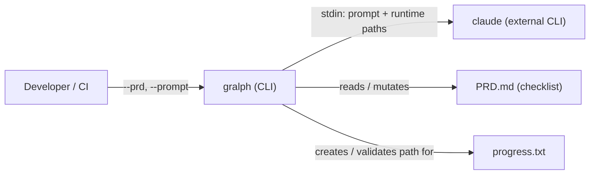

# Gralph — Architecture Overview

[Back to Project README](../../README.md)

## Table of Contents

- [Introduction](#introduction)
- [Core Concept](#core-concept)
- [System Model](#system-model)
- [Key Principles](#key-principles)
- [Document Navigation](#document-navigation)

## Introduction

Gralph is a portable Go CLI that replaces `scripts/ralph.sh` — a shell loop driver that iterates Claude Code against a PRD checklist until all items are complete or abandoned. It accepts explicit file paths for the prompt template, PRD checklist, and optional progress log, then runs `claude --print --dangerously-skip-permissions` in a loop, advancing through checklist items one at a time.

The tool's sole consumer is a developer or CI job that wants to drive a multi-cycle, AI-assisted implementation workflow without writing their own loop. The shell script was the original implementation; gralph replaces it with a cross-platform binary that can be installed to `$GOBIN` and invoked identically from any shell.

## Core Concept

The loop is strictly sequential. Gralph reads the first `- [ ]` item, invokes Claude once, re-reads the PRD to detect completion, and repeats. Parallelism is out of scope.

## System Model

| Component | Description |
| --- | --- |
| `cmd/main` | CLI entrypoint — pflag parsing, flag validation, version output |
| `internal/looper` | Core loop — item detection, Claude invocation, retry/abandon control |
| `internal/version` | Version metadata and ASCII mascot, injected at build time |
| `scripts/ralph.sh` | Behavior reference / source of truth for loop semantics |
| `build/Dockerfile` | Docker-first multi-target build (darwin/amd64, darwin/arm64, linux/amd64, linux/arm64, windows/arm64) |
| `tests/e2e` | Separate Go module; black-box tests against the compiled binary |

## Key Principles

1. **Behavior parity with ralph.sh** — Every loop semantic (completion detection, retry counting, abandon mutation) must match the shell script. The script is the specification.
2. **Minimal external dependencies** — Standard library for file and process operations; pflag for flag parsing only. No framework abstractions over simple control flow.
3. **Testability at the seam** — The `commandRunner` function variable isolates `exec.Cmd` from all loop logic, enabling deterministic unit tests without a real Claude binary.
4. **Docker-first release build** — The canonical build path runs inside Docker, enforcing linters, security scanners, and tests before producing binaries. Local `go build` is for development only.
5. **Fail-open on Claude errors** — Non-zero Claude exits count as failed attempts, not fatal errors. The loop continues so transient failures do not abort an entire PRD run.

## Document Navigation

| # | Document | Description | Status |
| --- | --- | --- | --- |
| 00 | [Overview](00-overview.md) | This document | Current |
| 01 | [Requirements](01-requirements.md) | Problem statement, goals, constraints | Current |
| 02 | [Architectural Decisions](02-architectural-decisions.md) | ADR log | Current |
| 03 | [System Architecture](03-system-architecture.md) | Components, data flow, boundaries | Current |
| 05 | [Deployment Architecture](05-deployment-architecture.md) | Build pipeline, release, distribution | Current |

**Next:** [Requirements](01-requirements.md)
