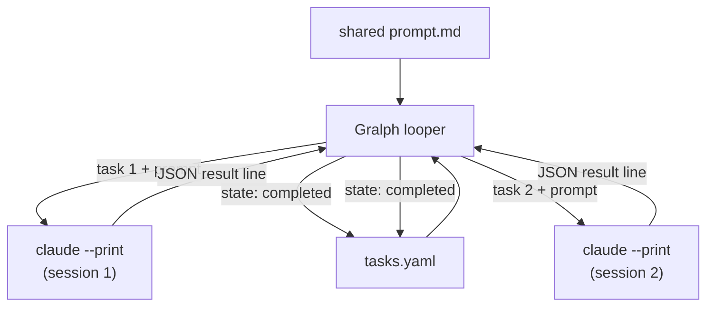

# Gralph — Architecture Overview

> **Version**: v10
> **Date**: 2026-10-02
> **Notes**: Dropped the Deployment Architecture document from the navigation; it was archived as more than a console app needs.

[Back to Project README](../../README.md)

## Table of Contents

- [Introduction](#introduction)
- [Core Concept](#core-concept)
- [System Model](#system-model)
- [Key Principles](#key-principles)
- [Document Navigation](#document-navigation)

## Introduction

Gralph is a Go CLI that automates "Ralph loops": structured, multi-step AI workflows where a shared prompt is combined with sequential tasks and executed in fresh Claude sessions. Each task runs independently, with state tracked atomically in a YAML file. A failed task blocks the run until manually addressed, ensuring intentional intervention.

Gralph was built specifically for Claude Code (`claude.ai/code`); an agent-agnostic runtime was prototyped and rolled back. The CLI is Unix-only and designed for use by developers and automation scripts.

## Core Concept

The Ralph loop is a command sequence driven by a shared prompt and an ordered task list. Gralph implements this pattern by:

1. Loading a shared prompt (Markdown) and task list (YAML)
2. For each pending task, combining the prompt + task and starting a fresh `claude --print` session with the session flags chosen by `--sandbox-settings` (sandboxed) or `--skip-permissions` (no sandbox); the TUI adds `--output-format stream-json --verbose`
3. Reading Claude's output to determine success/failure
4. When Claude reports success, running the task's `gates` (commands listed in the task file) and requiring every one to exit zero
5. With `--commit`, committing the task's changes with git once its gates pass, under the task's name
6. Writing state back atomically
7. Blocking on the first failure until a person intervenes

In a terminal, gralph shows the run in a full-screen view: the current task's prompt, the task list and statuses, and the current session's live activity. With `--no-tui`, `--dry-run`, or no terminal, it runs in plain mode and prints to stdout as it always has. With `--log-dir`, a full-screen run also leaves a record on disk: a ledger of what ran and when, and each task's activity.

## System Model

| Component          | Description                                                                                                                                   |
| ------------------ | --------------------------------------------------------------------------------------------------------------------------------------------- |
| CLI Entrypoint     | Parses flags, picks plain or TUI mode, routes to Start/DryRun or the TUI                                                                      |
| Terminal UI        | Setup screen for missing paths; run view fed live by looper events (`internal/tui`)                                                           |
| Looper             | Orchestrates the loop: loads files, checks preconditions, runs tasks sequentially; plain or stream-json task path chosen by the `report` hook |
| Task Parser        | Strict YAML validation: rejects any invalid element, whole file fails at parse time                                                           |
| Process Manager    | Spawns claude subprocess in its own process group; kills group on SIGINT/SIGTERM                                                              |
| State Persistence  | Atomic task state writes via temp-file + rename; YAML rewritten on every change                                                               |
| Result Interpreter | Parses JSON result line from claude output; missing/invalid line = failed                                                                     |
| Gate Runner        | After a `completed` session, runs the task's `gates` commands with `sh -c`; any non-zero exit = failed                                        |
| Committer          | With `--commit`, commits a completed task's changes after its gates; requires a clean work tree at startup                                    |
| Run Log Writer     | With `--log-dir` (TUI only), writes a JSON-lines ledger and a detail file per task from the looper's events (`internal/runlog`)               |

## Key Principles

1. **Claude Code only** — Not an agent abstraction layer. No provider profiles or `--agent-*` flags.
2. **One session per task** — Each task is independent; cold start every time. Shared prompt + task prompt via stdin.
3. **Strict validation** — Invalid YAML elements (bad id, empty name/prompt, unknown state) reject the entire file at parse time.
4. **Atomic state writes** — Task state written via temp-file + rename after every run, with no retry on write failure.
5. **Outcome from JSON, not exit code** — Result determined by parsing the final non-blank JSON line; missing/invalid line is always failed, never a fallback to exit code.
6. **Gates confirm a completed task** — A session's `completed` is then checked by gralph itself: the task's `gates` commands run in order and every one must exit zero. Claude is never sent the gates.
7. **Failed task blocks** — A failed task must be manually reset (state changed to pending or completed) before the next run. Gralph refuses to start with any failed task present.
8. **Unix only** — Linux, macOS, BSDs. Windows support was removed deliberately and will not be reintroduced.
9. **Sandboxed unless asked otherwise by name** — A run must pass `--sandbox-settings <path>` (sessions run in Claude Code's sandbox) or `--skip-permissions` (no sandbox, the user's responsibility). There is no default and no fallback to an unsandboxed run.
10. **Gralph commits, not the session** — With `--commit`, a commit is made only after the gates pass; a failed task is never committed.
11. **Plain mode intact** — The full-screen TUI is the default in a terminal, but plain mode (`--no-tui` or no terminal) keeps the same argv, output, and exit codes. One loop serves both, through a `report` hook.
12. **Docker-first CI** — Lint, gosec, govulncheck, unit tests, and e2e all run inside the build container; this is the only supported CI path.

## Document Navigation

| #   | Document                                                    | Description                           | Status  |
| --- | ----------------------------------------------------------- | ------------------------------------- | ------- |
| 00  | [Overview](00_overview.md)                                  | This document                         | Current |
| 01  | [Requirements](01_requirements.md)                          | Problem statement, goals, constraints | Active  |
| 02  | [Architectural Decisions](02_architectural_decisions.md)    | ADR log                               | Active  |
| 03  | [System Architecture](03_system_architecture.md)            | Components, data flow, boundaries     | Active  |

**Next:** [Requirements](01_requirements.md)
