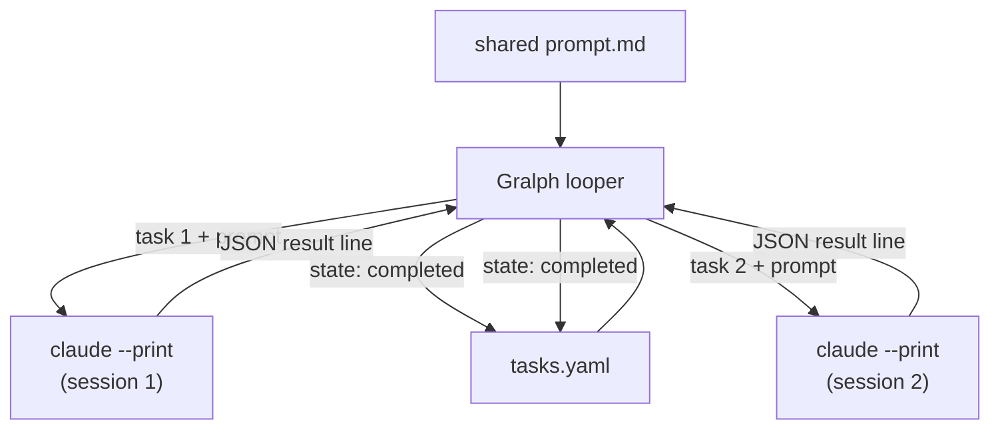

# Gralph — Architecture Overview

> **Version**: v01
> **Date**: 2026-09-25
> **Notes**: Realigned to the v0.6.2 design; replaces the unversioned pre-YAML docs.

[Back to Project README](../../README.md)

## Table of Contents

- [Introduction](#introduction)
- [Core Concept](#core-concept)
- [System Model](#system-model)
- [Key Principles](#key-principles)
- [Document Navigation](#document-navigation)

## Introduction

Gralph is a Go CLI that automates "Ralph loops": structured, multi-step AI workflows where a shared prompt is combined with sequential tasks and executed in fresh Claude sessions. Each task runs independently, with state tracked atomically in a YAML file. A failed task blocks the run until manually addressed, ensuring intentional intervention.

Gralph was built specifically for Claude Code (`claude.ai/code`); an agent-agnostic runtime was prototyped and rolled back. The CLI is Unix-only, production-ready for CLI deployment, and designed for use by developers and automation scripts.

## Core Concept

The Ralph loop is a command sequence driven by a shared prompt and an ordered task list. Gralph implements this pattern by:

1. Loading a shared prompt and task list (both YAML)
2. For each pending task, combining the prompt + task and starting a fresh `claude --print --dangerously-skip-permissions` session
3. Reading Claude's output to determine success/failure
4. Writing state back atomically
5. Blocking on the first failure until a person intervenes

## System Model

| Component          | Description                                                                         |
| ------------------ | ----------------------------------------------------------------------------------- |
| CLI Entrypoint     | Parses flags, validates required arguments, routes to Start or DryRun               |
| Looper             | Orchestrates the loop: loads files, checks preconditions, runs tasks sequentially  |
| Task Parser        | Strict YAML validation: rejects any invalid element, whole file fails at parse time |
| Process Manager    | Spawns claude subprocess in its own process group; kills group on SIGINT/SIGTERM   |
| State Persistence  | Atomic task state writes via temp-file + rename; YAML rewritten on every change    |
| Result Interpreter | Parses JSON result line from claude output; missing/invalid line = failed          |

## Key Principles

1. **Claude Code only** — Not an agent abstraction layer. No provider profiles or `--agent-*` flags.
2. **One session per task** — Each task is independent; cold start every time. Shared prompt + task prompt via stdin.
3. **Strict validation** — Invalid YAML elements (bad id, empty name/prompt, unknown state) reject the entire file at parse time.
4. **Atomic state writes** — Task state written via temp-file + rename after every run, with no retry on write failure.
5. **Outcome from JSON, not exit code** — Result determined by parsing the final non-blank JSON line; missing/invalid line is always failed, never a fallback to exit code.
6. **Failed task blocks** — A failed task must be manually reset (state changed to pending or completed) before the next run. Gralph refuses to start with any failed task present.
7. **Unix only** — Linux, macOS, BSDs. Windows support was removed deliberately and will not be reintroduced.
8. **Docker-first CI** — Lint, gosec, govulncheck, unit tests, and e2e all run inside the build container; this is the only supported CI path.

## Document Navigation

| #   | Document                                                    | Description                           | Status  |
| --- | ----------------------------------------------------------- | ------------------------------------- | ------- |
| 00  | [Overview](00_overview_v01.md)                              | This document                         | Current |
| 01  | [Requirements](01_requirements_v01.md)                      | Problem statement, goals, constraints | Active  |
| 02  | [Architectural Decisions](02_architectural_decisions_v01.md) | ADR log                               | Active  |
| 03  | [System Architecture](03_system_architecture_v01.md)        | Components, data flow, boundaries     | Active  |
| 05  | [Deployment Architecture](05_deployment_architecture_v01.md) | Deployment, infrastructure, scaling   | Active  |

**Next:** [Requirements](01_requirements_v01.md)
