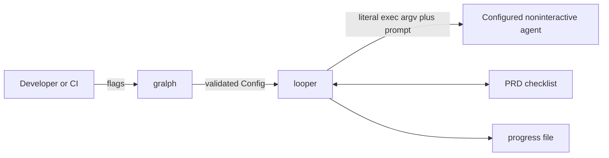

# Gralph Architecture Overview

> Version: v01
> Date: 2026-08-21
> Notes: Provider-neutral runtime architecture.

[Project README](../../README.md)

## Table of Contents

- [Purpose](#purpose)
- [System model](#system-model)
- [Document navigation](#document-navigation)

## Purpose

Gralph is a portable Go CLI for sequential PRD checklist loops. It is agent
agnostic: the caller configures an executable, literal argument vector, and
prompt transport rather than relying on a provider selected by core code.

## System model

The loop is sequential. Only a started process with a non-zero exit status is
retryable; all configuration, setup, startup, and cancellation failures are
fatal and preserve the PRD.

## Document navigation

| # | Document | Description |
| --- | --- | --- |
| 00 | [Overview](00_overview_v01.md) | Scope and navigation |
| 01 | [Requirements](01_requirements_v01.md) | Product contract and constraints |
| 02 | [Architectural Decisions](02_architectural_decisions_v01.md) | Active ADRs |
| 03 | [System Architecture](03_system_architecture_v01.md) | Components and trust boundaries |
| 05 | [Deployment Architecture](05_deployment_architecture_v01.md) | Build and operations |

**Next:** [Requirements](01_requirements_v01.md)
