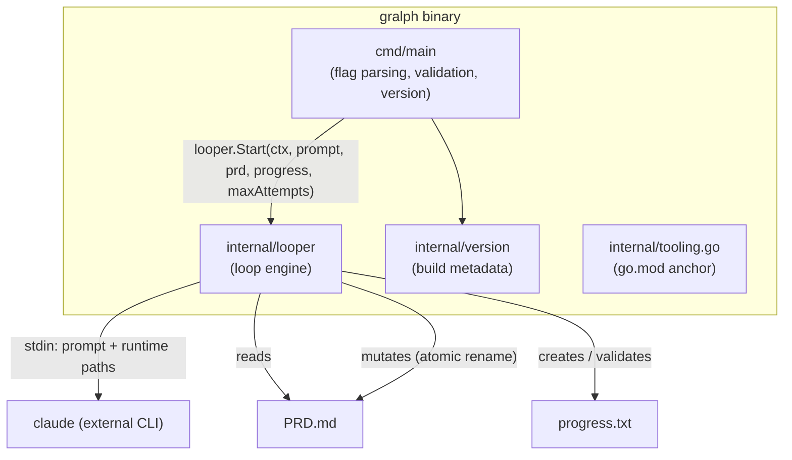
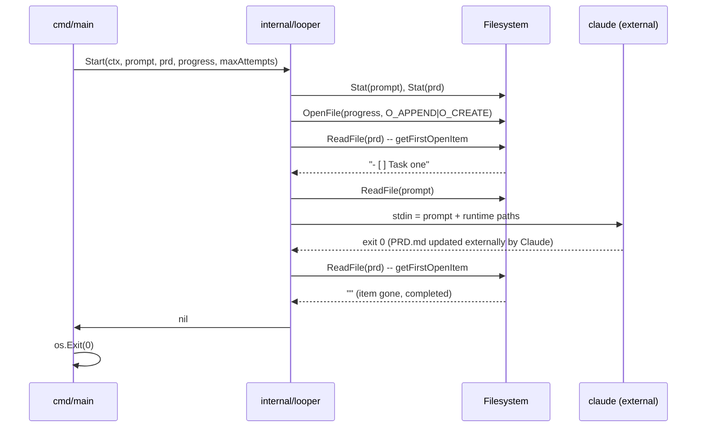
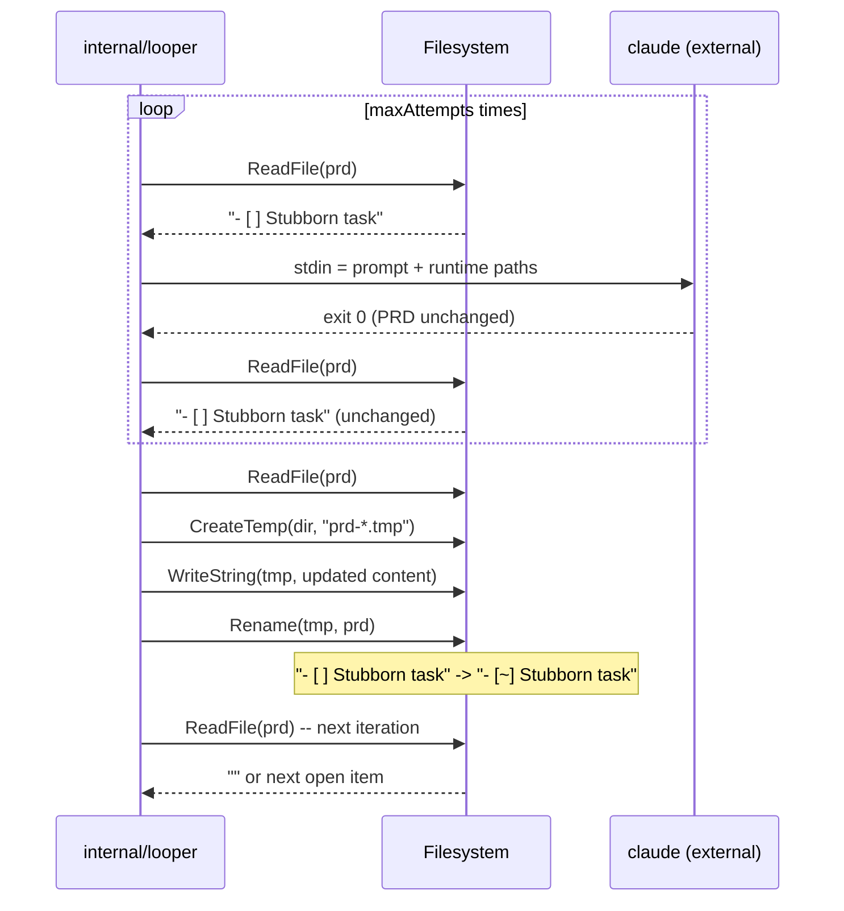
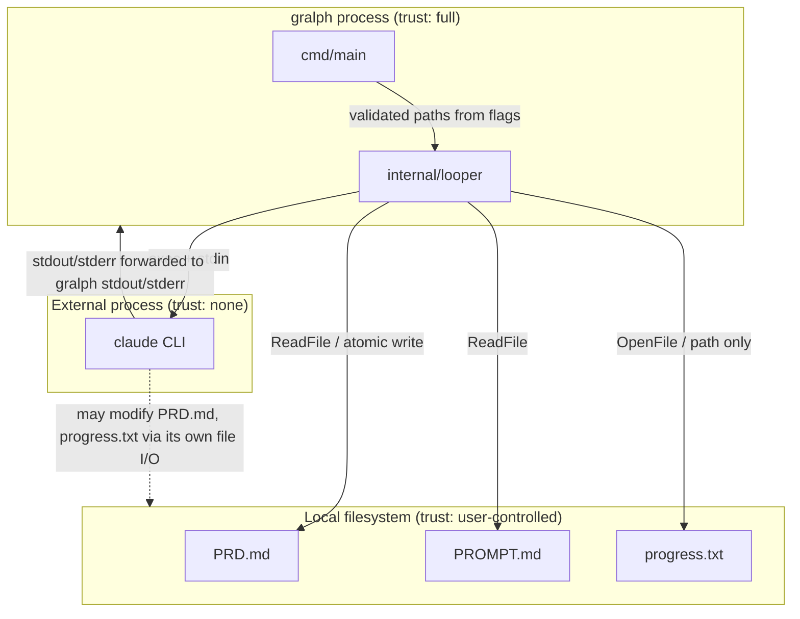

# Gralph — System Architecture

[Back to Overview](00-overview.md) | [Back to Project README](../../README.md)

## Table of Contents

- [Architecture Overview](#architecture-overview)
- [Component Breakdown](#component-breakdown)
- [Data Flow](#data-flow)
- [Component Interactions](#component-interactions)
- [Boundary Definitions](#boundary-definitions)

## Architecture Overview

Gralph is a single-process CLI with two internal layers: a thin entrypoint that parses flags and validates inputs, and a loop engine that owns all PRD lifecycle logic. There is no server, no network, and no persistent state beyond the two files it reads and mutates on disk.

## Component Breakdown

### cmd/main

**Responsibilities:**

- Parse CLI flags using pflag.
- Validate that required flags (`--prd`, `--prompt`) are set; print actionable errors and exit non-zero if not.
- Handle `--version` as an immediate-exit path before any file I/O.
- Delegate all loop behavior to `looper.Start`.

**Key Characteristics:**

| Characteristic        | Value                        |
| --------------------- | ---------------------------- |
| Language/Runtime      | Go 1.26, statically compiled |
| Persistence           | None                         |
| Scaling Model         | N/A — single invocation      |
| External Dependencies | pflag                        |

### internal/looper

**Responsibilities:**

- Validate that prompt and PRD files are accessible.
- Resolve or create the progress file path.
- Run the loop: detect the first `- [ ]` item, invoke Claude, detect completion, count retries, abandon at the limit.
- Mutate PRD.md atomically when abandoning an item.
- Log each loop phase to stdout.

**Key Characteristics:**

| Characteristic        | Value                                                     |
| --------------------- | --------------------------------------------------------- |
| Language/Runtime      | Go 1.26                                                   |
| Persistence           | PRD.md (read/write), progress.txt (create/append)         |
| Scaling Model         | Single-threaded, sequential loop                          |
| External Dependencies | None (standard library only)                              |
| Test Seam             | `claudeRunner` package-level variable, swappable in tests |

### internal/version

**Responsibilities:**

- Hold `version`, `buildDate`, and `gitCommit` variables injected by `-ldflags` at build time.
- Render the ASCII mascot and version string when `Print()` is called.

### internal/tooling.go

**Responsibilities:**

- Blank-import Cobra, Viper, and testify to retain them as direct dependencies in `go.mod`.
- Has no runtime behavior.

## Data Flow

### Happy path: item completed on first attempt

### Failure path: item abandoned after max attempts

## Component Interactions

| From              | To                  | Protocol                           | Purpose                                   | Data Format                                              |
| ----------------- | ------------------- | ---------------------------------- | ----------------------------------------- | -------------------------------------------------------- |
| `cmd/main`        | `internal/looper`   | Direct function call               | Delegate loop execution                   | Go function arguments                                    |
| `internal/looper` | `claude` (external) | `os/exec` + stdin pipe             | Run one Claude iteration                  | Plain text (prompt + runtime paths appended as Markdown) |
| `internal/looper` | PRD.md              | `os.ReadFile` / atomic rename      | Read item state; persist abandon mutation | UTF-8 Markdown                                           |
| `internal/looper` | progress.txt        | `os.OpenFile` (O_APPEND\|O_CREATE) | Ensure file exists; pass path to Claude   | N/A (gralph does not write entries)                      |

## Boundary Definitions

**Boundary Rules:**

| Boundary          | What Crosses                                                    | Rules                                                                                                 |
| ----------------- | --------------------------------------------------------------- | ----------------------------------------------------------------------------------------------------- |
| CLI -> Looper     | Validated file paths, maxAttempts int, context                  | Paths are stat-checked before passing; missing files exit non-zero in CLI layer                       |
| Looper -> Claude  | Prompt text + runtime paths appended as Markdown                | Command name (`claude`) is a literal; no user-controlled arguments are passed to exec — `#nosec G204` |
| Looper -> PRD.md  | Full file content on read; full updated content on atomic write | Write uses temp+rename to avoid partial writes; no in-place byte patching                             |
| Claude -> LocalFS | Claude may write to PRD.md and progress.txt independently       | Gralph re-reads PRD after each invocation; it does not trust its in-memory state across Claude calls  |

**Next:** [Deployment Architecture](05-deployment-architecture.md)
