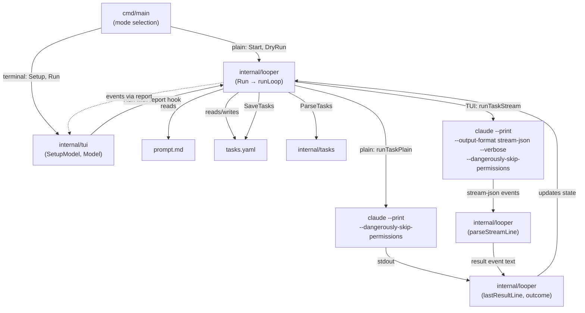
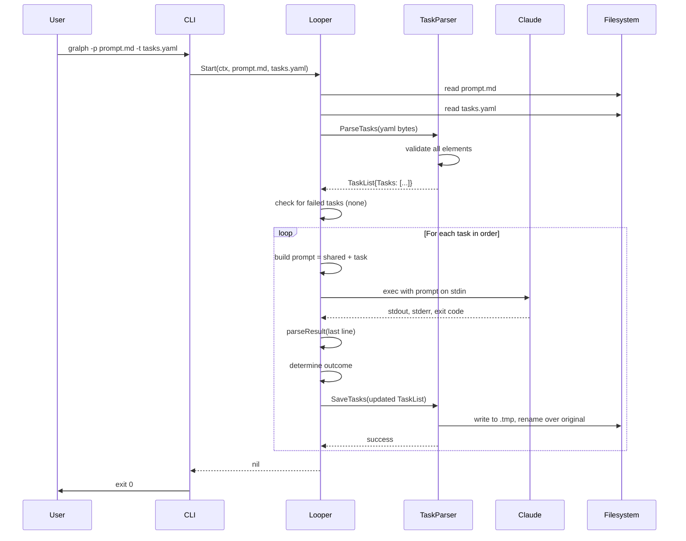
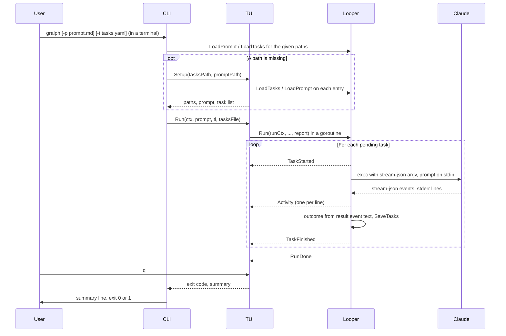
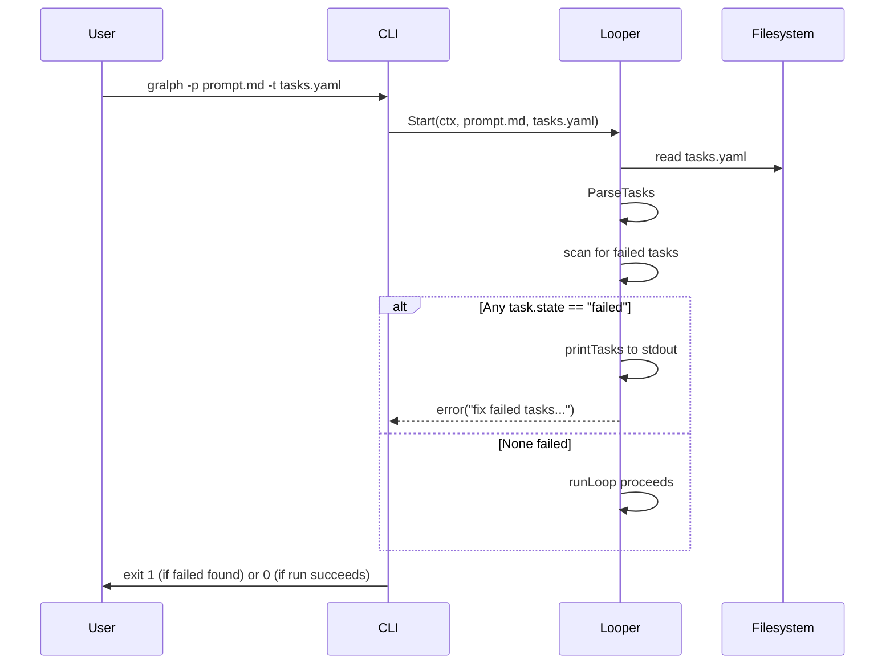
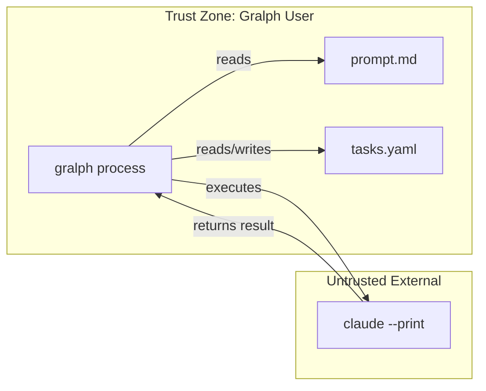
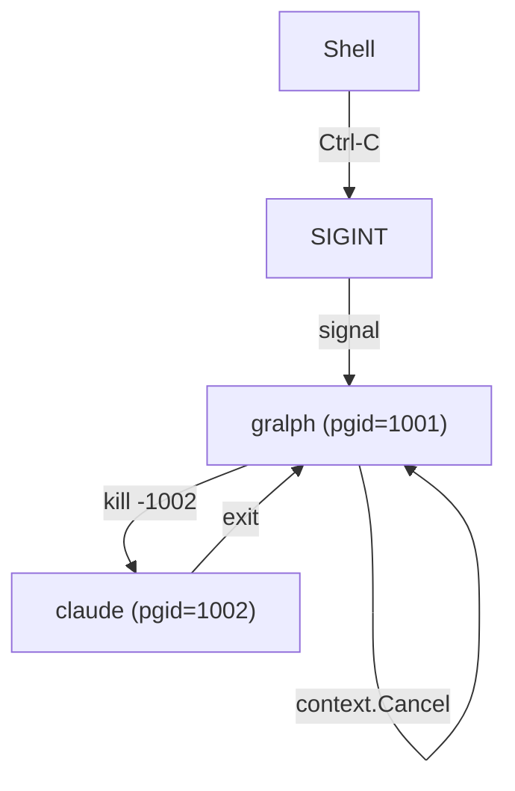

# Gralph — System Architecture

> **Version**: v02
> **Date**: 2026-09-25
> **Notes**: Added the full-screen TUI (`internal/tui`), mode selection, the `report` hook, and the two task paths (plain and stream-json).

[Back to Overview](00_overview.md) | [Back to Project README](../../README.md)

## Table of Contents

- [Architecture Overview](#architecture-overview)
- [Component Breakdown](#component-breakdown)
- [Data Flow](#data-flow)
- [Component Interactions](#component-interactions)
- [Boundary Definitions](#boundary-definitions)

## Architecture Overview

Gralph is organized into four layers: CLI entry point, terminal UI, looper orchestration, and task/state management. Dependencies point one way: `cmd/main` → `internal/tui` → `internal/looper` → `internal/tasks` (`cmd/main` also calls `internal/looper` directly). The looper loads both input files (prompt.md and tasks.yaml), validates preconditions, then walks each pending task, spawning a fresh Claude session with the combined prompt and reading the result to determine outcome.

`cmd/main` picks one of two modes (ADR-011):

- **Plain mode** — `--dry-run`, `--no-tui`, or stdin or stdout not a terminal. `looper.Start` runs the loop with a nil `report` hook; each task goes through `runTaskPlain`, which runs `claude --print --dangerously-skip-permissions`, echoes the combined prompt, tees claude's stdout, and inherits its stderr.
- **TUI mode** — otherwise. `tui.Run` runs `looper.Run` in a goroutine with a `report` hook that forwards events to the Bubble Tea program; each task goes through `runTaskStream`, which runs `claude --print --output-format stream-json --verbose --dangerously-skip-permissions` and writes nothing to gralph's own stdout or stderr.

## Component Breakdown

### CLI Entrypoint (cmd/main)

**Responsibilities:**
- Parse command-line flags (--prompt, --tasks, --dry-run, --no-tui, --install-skill, --version)
- Choose the mode: plain when `--dry-run`, `--no-tui`, or stdin or stdout is not a terminal (`github.com/charmbracelet/x/term`); otherwise the TUI
- Plain mode: validate required flags, then route to `looper.Start` (normal run) or `looper.DryRun` (validation only)
- TUI mode: load the given paths with `looper.LoadPrompt`/`looper.LoadTasks` (a failed task prints the `PrintTasks` table and exits 1, as in plain mode), run `tui.Setup` for any missing path, then `tui.Run`, and print the one-line summary after the view closes
- Set up context with signal handling (SIGINT, SIGTERM)
- Exit with appropriate code (0 on success, 1 on error); a Bubble Tea error exits 1 with a hint to rerun with `--no-tui`

**Key Characteristics:**

| Characteristic      | Value                                   |
| ------------------- | --------------------------------------- |
| Language            | Go 1.27.1+                              |
| Responsibilities    | Argument parsing, mode selection, signal setup, routing |
| Error Handling      | Print to stderr, exit 1 on any error    |
| State Management    | Stateless; passes context to looper     |

### Terminal UI (internal/tui)

**Responsibilities:**
- `Setup`/`SetupModel`: the path-entry screen; one text field per missing `--tasks`/`--prompt` path, each validated on Enter with `looper.LoadTasks` or `looper.LoadPrompt`, errors shown under the field; Esc or ctrl+c cancels (exit 1)
- `Run`: derives a cancellable context from `cmd/main`'s signal context, runs `looper.Run` in a goroutine with a `report` hook that calls `program.Send`, and returns the exit code and summary when the view closes
- `Model`: the run view (alt screen, relaid out on resize) with a prompt pane (current task's `<id>: <name>` and prompt), a tasks pane (icon, name, state per task), an output pane (the current task's activity, cleared on each `TaskStarted`, following the newest line unless scrolled up), and a key legend that also carries the confirm prompt and final status
- Keys: `tab` switches the focused pane, `↑/↓/PgUp/PgDn` scroll it; `q` or ctrl+c opens a `[y/N]` stop confirm during the run and quits after it
- Shows `in progress` for the running task; it is display only and never saved

**Key Characteristics:**

| Characteristic      | Value                                                       |
| ------------------- | ----------------------------------------------------------- |
| Libraries           | Bubble Tea v2, bubbles v2 (viewport, textinput), lipgloss v2 (ADR-012) |
| Imported by         | `cmd/main` only; `looper` and `tasks` never import it or Bubble Tea |
| Input from looper   | `looper.Event` messages: `TaskStarted`, `Activity`, `TaskFinished`, `RunDone` |
| Signal Handling     | Bubble Tea's own handler is off (`tea.WithoutSignalHandler`) |
| Exit code           | 0 only when every task completed; 1 on a failed task or a stop |

### Looper (internal/looper)

**Responsibilities:**
- Load and validate prompt file (`LoadPrompt`: must exist, readable, non-empty after trimming)
- Load and parse task file via `tasks.ParseTasks` (`LoadTasks`)
- Check preconditions (`LoadTasks` returns the list plus `ErrFailedTasks` if any task is `failed`; `Start` then prints the table and refuses to run)
- Iterate pending tasks in file order (`Run` → `runLoop`)
- Combine shared prompt with each task
- Run each task on one of two paths, picked by the `report` hook:
  - `report == nil` → `runTaskPlain`: spawn `claude --print --dangerously-skip-permissions` in a process group, echo the combined prompt, tee claude's stdout, inherit stderr
  - `report != nil` → `runTaskStream`: spawn `claude --print --output-format stream-json --verbose --dangerously-skip-permissions` in a process group, write nothing to gralph's stdout/stderr, report `TaskStarted`, `Activity` (parsed stdout events and raw stderr lines), and `TaskFinished` events, then `RunDone` from `Run`
- Capture output, parse result line, determine outcome
- Update task state and save atomically
- Block on first failure
- Handle SIGINT/SIGTERM via context cancellation (kills claude process group)

**Key Characteristics:**

| Characteristic      | Value                                   |
| ------------------- | --------------------------------------- |
| Language            | Go 1.27.1+                              |
| Core Function       | `Run(ctx, prompt, tl, tasksFile, report)` runs the loop; `Start(ctx, promptFile, tasksFile)` is plain mode's load + `Run(..., nil)` |
| Scaling Model       | Sequential tasks; on the TUI path stdout and stderr are read concurrently, so `report` may be called from more than one goroutine |
| Communication       | Reads files, spawns subprocess, reads stdout (plain text or stream-json) |
| UI dependency       | None; never imports `internal/tui` or Bubble Tea |
| State Persistence   | Calls `tasks.SaveTasks` after each run  |

### Task Parser (internal/tasks)

**Responsibilities:**
- Unmarshal YAML without custom tags (rejects non-core tags)
- Validate each task element in sequence:
  - `id`: required, positive int16, unique
  - `name`: required, non-empty string, unique (case-insensitive)
  - `prompt`: required, non-empty string
  - `state`: optional string, must be "pending", "completed", or "failed"
  - `error`: optional string, written by gralph only
- Normalize `state`: empty → `pending`
- Save tasks back to YAML with 2-space indent, atomically (temp file + rename)

**Key Characteristics:**

| Characteristic      | Value                                           |
| ------------------- | ----------------------------------------------- |
| Language            | Go + gopkg.in/yaml.v3                           |
| Validation Model    | Strict: any invalid element rejects entire file |
| Persistence         | Atomic writes via temp-file + rename to path    |
| Comments            | Not preserved on rewrite (full re-marshal)      |

### Process Tree Manager (internal/looper/process_tree_unix.go)

**Responsibilities:**
- Configure spawned claude process to run in its own process group (Setpgid)
- On signal (SIGINT, SIGTERM), kill the entire process group
- Ensure no orphaned claude processes remain after cancellation

**Key Characteristics:**

| Characteristic      | Value                                       |
| ------------------- | ------------------------------------------- |
| OS Support          | Unix only (Linux, macOS, BSDs)              |
| Signal Handling     | SIGINT, SIGTERM from context cancellation   |
| Process Control     | kill(-pgid, signal) to terminate group      |

### Stream Parser (internal/looper/stream.go)

**Responsibilities:**
- Read claude's stream-json stdout line by line with no length limit (`bufio.Reader`, not a 64 KiB `bufio.Scanner`), and drain stdout and stderr to EOF before `cmd.Wait`
- `parseStreamLine`: `assistant` events become activity lines (`text` blocks one line per non-blank line; `tool_use` blocks `→ <Name> <target>`, where target is the Bash command, the Read/Edit/Write file path, or the Grep/Glob pattern, cut to one line); the `result` event's `result` text is kept for the outcome; other event types and undecodable lines are ignored

**Key Characteristics:**

| Characteristic      | Value                                   |
| ------------------- | --------------------------------------- |
| Used by             | TUI path only (`runTaskStream`)         |
| Input               | One JSON event per stdout line          |
| Output              | Activity lines; the result event's text |

### Result Parser (internal/looper/result.go)

**Responsibilities:**
- Extract last non-blank, non-fence line from claude's stdout (plain) or from the stream's `result` event text (TUI)
- Parse as JSON with `state` and `error` fields
- Determine task outcome: completed if exit 0 + JSON `state: "completed"`, otherwise failed
- Format error message from JSON `error` or exit code

**Key Characteristics:**

| Characteristic      | Value                                   |
| ------------------- | --------------------------------------- |
| Input               | Claude's stdout (plain) or `result` event text (TUI), and exit code |
| Output              | (state, error message) tuple            |
| Fence Handling      | Skips lines matching ^\`\`\`             |
| JSON Parsing        | encoding/json; no custom unmarshallers  |

## Data Flow

### Normal Run (Happy Path)

### TUI Run

The loop is the same as above; only the task path and the reporting differ.

A cancelled task sends no `TaskFinished`; `RunDone` follows with the cancellation error and the view shows that task as `pending`.

### Failed Task Blocking

## Component Interactions

| From        | To              | Protocol                         | Purpose                                    | Data Format        |
| ----------- | --------------- | -------------------------------- | ------------------------------------------ | ------------------ |
| CLI         | Looper          | Direct function call             | Plain start or dry-run; load paths for the TUI | Go function args |
| CLI         | TUI             | Direct function call             | Setup screen and run view                  | Go function args   |
| TUI         | Looper          | `Run` with `report` hook         | Run the loop, receive progress             | `looper.Event`     |
| Looper      | Filesystem      | os.ReadFile, os.WriteFile        | Load inputs, persist state                 | Text files (YAML)  |
| Looper      | TaskParser      | ParseTasks, SaveTasks functions  | Parse and serialize task lists             | YAML bytes         |
| Looper      | Claude          | os/exec.Cmd, stdin/stdout/stderr | Invoke Claude session                      | Text (prompt)      |
| Claude      | Looper          | stdout, exit code                | Return output and completion status        | Plain: text ending in a JSON result line; TUI: stream-json events, the `result` event's text ending in it |
| Looper      | ProcessManager  | Setpgid, kill(-pgid)             | Configure and control subprocess lifecycle | Unix signals       |

## Boundary Definitions

### Trust Boundary: Gralph Process vs. Filesystem

Gralph reads the prompt and task files. Both must be treated as user-provided code (they are executed by Claude). Gralph does not sanitize or sandbox them; the user is responsible for not running gralph against untrusted prompts or task files.

**Boundary Rules:**

| Boundary                              | What Crosses        | Rules                                                      |
| ------------------------------------- | ------------------- | ---------------------------------------------------------- |
| Gralph → Filesystem (read)            | Prompt, task files  | Files must be readable; content is not sanitized           |
| Gralph ← Filesystem (write)           | Task state          | Atomic writes; temp-file + rename ensures consistency      |
| Gralph → Claude (subprocess)          | Combined prompt     | Passed on stdin; fixed argv per mode: plain `--print --dangerously-skip-permissions`, TUI adds `--output-format stream-json --verbose` |
| Claude → Gralph (subprocess output)   | Stdout, stderr, exit code | Parsed for JSON result line; plain mode passes all other output through, the TUI shows it as activity only |

### Process Boundary: Gralph Process Group

When gralph spawns claude, the subprocess runs in its own process group. On SIGINT/SIGTERM, the entire group is killed, isolating the signal from the host shell.

**Boundary Rules:**

- Gralph configures Setpgid on the claude subprocess so it has its own process group ID
- On signal, gralph's context cancels and kills the entire claude process group with kill(-pgid, signal)
- Shell does not send signal directly to claude; only gralph receives it
- In the TUI the terminal is raw, so a keyboard Ctrl-C is a key, not a signal: `q` or ctrl+c opens a `[y/N]` confirm, and only `y` cancels the run ("Run stopped by user"). An outside SIGINT/SIGTERM cancels at once with no confirm ("Run stopped by signal"). Either stop kills the process group, shows the running task as `pending`, leaves the file untouched, and exits 1
- This ensures no orphaned claude processes if gralph is killed unexpectedly

**Next:** [Deployment Architecture](05_deployment_architecture.md)
