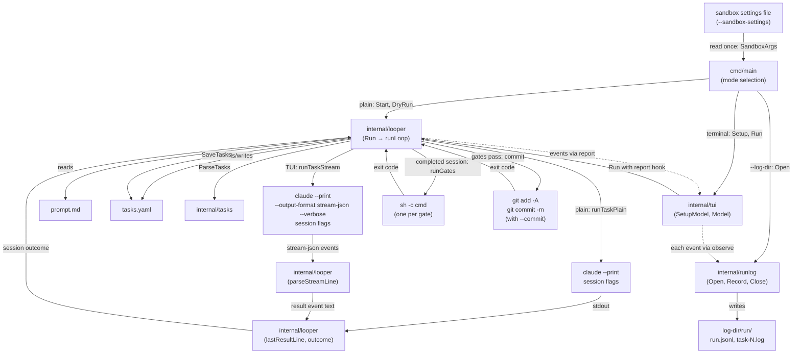
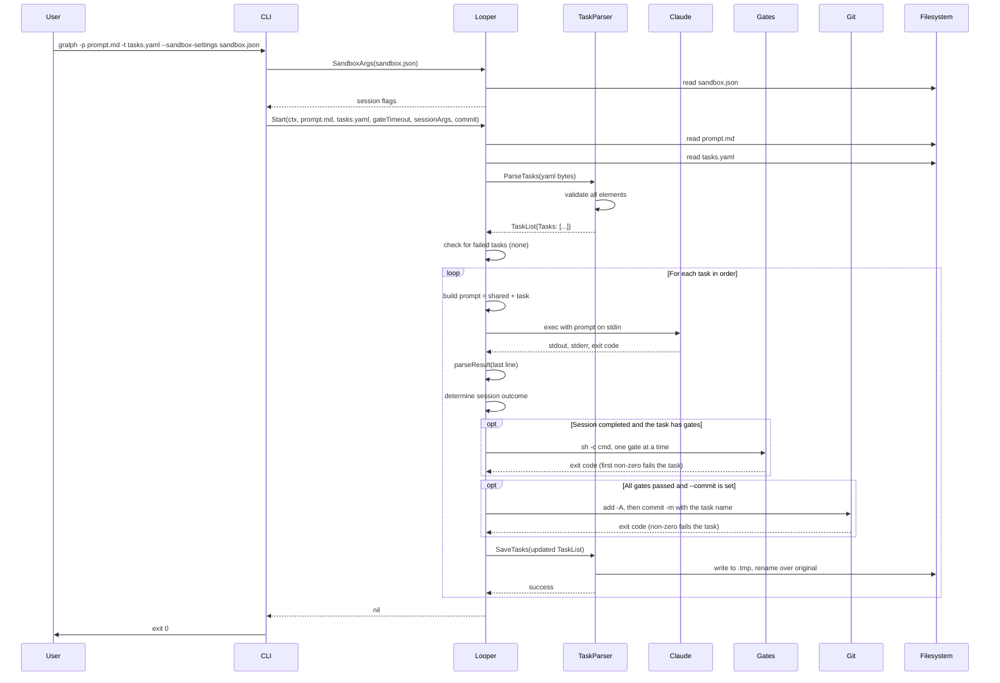
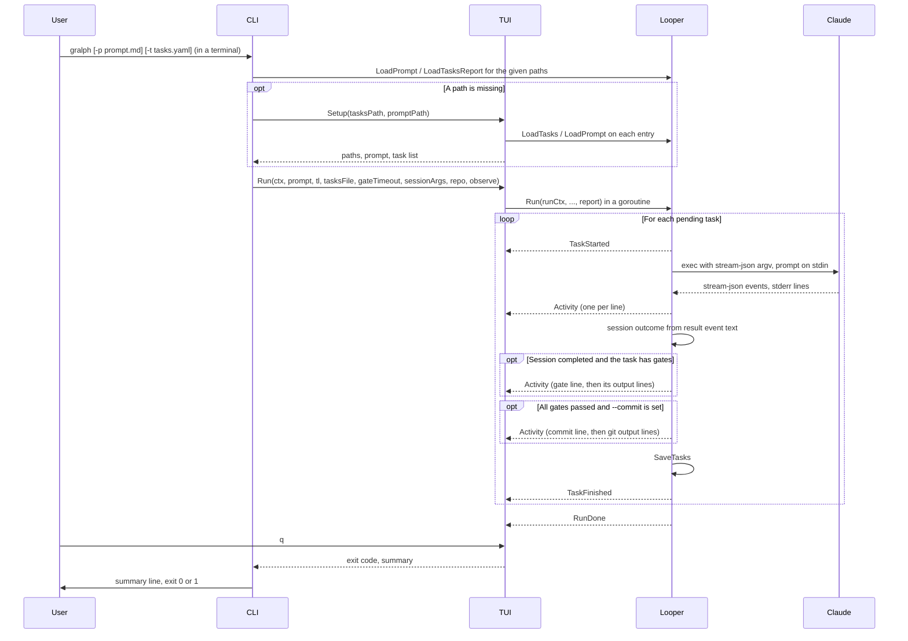
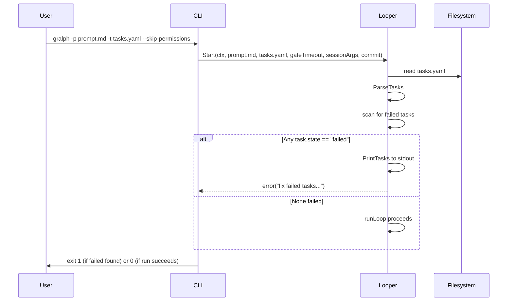
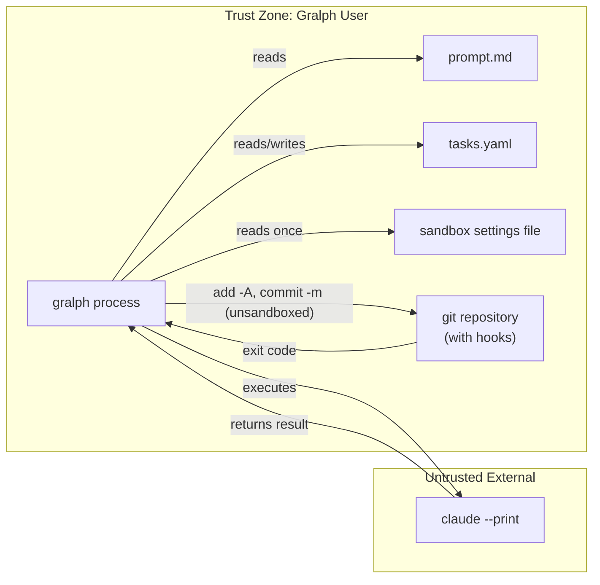
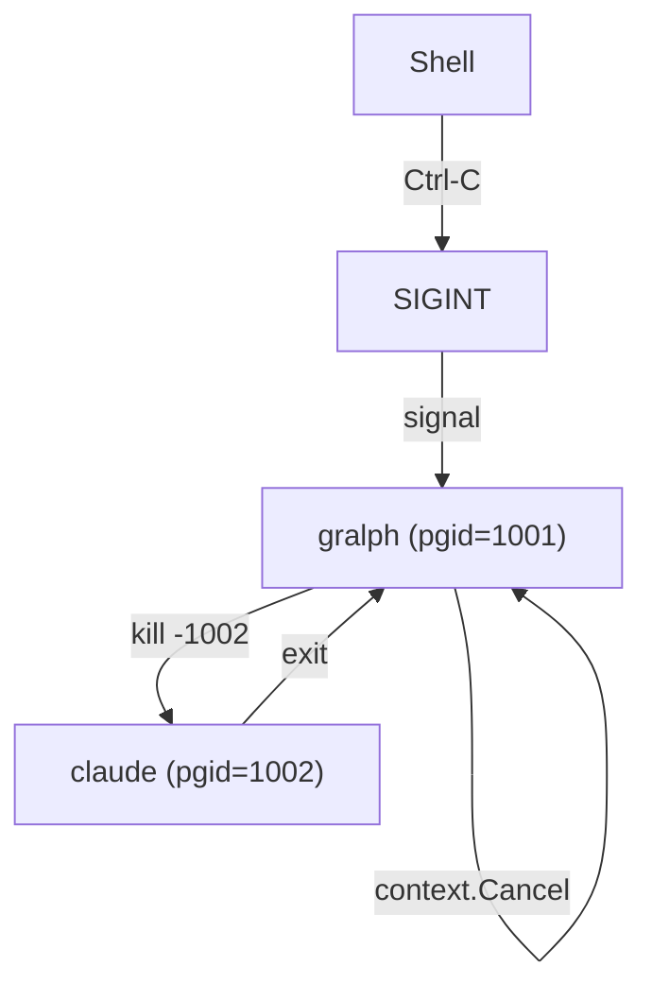

# Gralph — System Architecture

> **Version**: v14
> **Date**: 2026-10-02
> **Notes**: Removed the "Next" link to the Deployment Architecture document, which was archived; this is now the last document in the set.

[Back to Overview](00_overview.md) | [Back to Project README](../../README.md)

## Table of Contents

- [Architecture Overview](#architecture-overview)
- [Component Breakdown](#component-breakdown)
- [Data Flow](#data-flow)
- [Component Interactions](#component-interactions)
- [Boundary Definitions](#boundary-definitions)

## Architecture Overview

Gralph is organized into four layers: CLI entry point, terminal UI, looper orchestration, and task/state management. Dependencies point one way: `cmd/main` → `internal/tui` → `internal/looper` → `internal/tasks` (`cmd/main` also calls `internal/looper` directly). Beside them sits the run log writer, `internal/runlog` (ADR-016), used only with `--log-dir`: `cmd/main` → `internal/runlog` → `internal/looper`. The looper loads both input files (prompt.md and tasks.yaml), validates preconditions, then walks each pending task, spawning a fresh Claude session with the combined prompt and reading the result to determine outcome. When the session reports `completed`, the looper runs the task's gates (ADR-013), commands from the task file, and the task is completed only if every one exits zero. With `--commit` (ADR-015), inside a git work tree, the looper then commits the task's changes under the task's name; a commit git refuses fails the task.

Every session's argv is `claude --print` plus the **session flags** (ADR-014), which `cmd/main` picks once from the two permission flags and passes down as `sessionArgs`:

- `--sandbox-settings <path>` → `--permission-mode acceptEdits --settings <merged JSON>`: the session runs in Claude Code's sandbox.
- `--skip-permissions` → `--dangerously-skip-permissions`: no sandbox and no permission checks, on the user's say-so.

A real run with neither flag, or any run with both, exits 1.

`cmd/main` picks one of two modes (ADR-011):

- **Plain mode** — `--dry-run`, `--no-tui`, or stdin or stdout not a terminal. `looper.Start` runs the loop with a nil `report` hook; each task goes through `runTaskPlain`, which runs `claude --print <session flags>`, echoes the combined prompt, tees claude's stdout, and inherits its stderr.
- **TUI mode** — otherwise. `tui.Run` runs `looper.Run` in a goroutine with a `report` hook that hands each event to the optional `observe` hook (the run log, with `--log-dir`) and then forwards it to the Bubble Tea program; each task goes through `runTaskStream`, which runs `claude --print --output-format stream-json --verbose <session flags>` and writes nothing to gralph's own stdout or stderr.

```mermaid
graph TB
    CLI["cmd/main<br/>(mode selection)"]
    Settings["sandbox settings file<br/>(--sandbox-settings)"] -->|read once: SandboxArgs| CLI
    CLI -->|plain: Start, DryRun| Looper["internal/looper<br/>(Run → runLoop)"]
    CLI -->|terminal: Setup, Run| TUI["internal/tui<br/>(SetupModel, Model)"]
    TUI -->|Run with report hook| Looper
    Looper -.->|events via report| TUI
    CLI -->|"--log-dir: Open"| RunLog["internal/runlog<br/>(Open, Record, Close)"]
    TUI -.->|each event via observe| RunLog
    RunLog -->|writes| LogFiles["log-dir/run/<br/>run.jsonl, task-N.log"]
    Looper -->|reads| Prompt["prompt.md"]
    Looper -->|reads/writes| TaskFile["tasks.yaml"]
    Looper -->|ParseTasks| TaskParser["internal/tasks"]
    Looper -->|plain: runTaskPlain| ClaudePlain["claude --print<br/>session flags"]
    Looper -->|TUI: runTaskStream| ClaudeStream["claude --print<br/>--output-format stream-json --verbose<br/>session flags"]
    ClaudePlain -->|stdout| ResultParser["internal/looper<br/>(lastResultLine, outcome)"]
    ClaudeStream -->|stream-json events| StreamParser["internal/looper<br/>(parseStreamLine)"]
    StreamParser -->|result event text| ResultParser
    ResultParser -->|session outcome| Looper
    Looper -->|completed session: runGates| Gates["sh -c cmd<br/>(one per gate)"]
    Gates -->|exit code| Looper
    Looper -->|gates pass: commit| Git["git add -A<br/>git commit -m<br/>(with --commit)"]
    Git -->|exit code| Looper
    Looper -->|SaveTasks| TaskFile
```

## Component Breakdown

### CLI Entrypoint (cmd/main)

**Responsibilities:**

- Parse command-line flags (--prompt, --tasks, --sandbox-settings, --skip-permissions, --dry-run, --no-tui, --gate-timeout, --commit, --log-dir, --install-skill, --version)
- Validate `--gate-timeout` (if set) before any load or run; bad value exits 1
- Choose the mode: plain when `--dry-run`, `--no-tui`, or stdin or stdout is not a terminal (`github.com/charmbracelet/x/term`); otherwise the TUI
- Pick the session flags (`validateSessionFlags`/`sessionArgs`), after the `--gate-timeout` check and plain mode's required flags and before the skill check: `looper.SandboxArgs` for `--sandbox-settings`, `looper.BypassArgs` for `--skip-permissions`. Both flags together, or neither on a real run, exits 1; an empty `--sandbox-settings=` counts as not passed. A dry run needs neither, but a settings file it is given is still checked. The result goes to `looper.Start` and `tui.Run`
- Plain mode: validate required flags and `--gate-timeout`, then route to `looper.Start` (normal run) or `looper.DryRun` (validation only)
- TUI mode: load the given paths with `looper.LoadPrompt`/`looper.LoadTasksReport` (a failed task prints the `PrintTasks` table and exits 1, as in plain mode), run `tui.Setup` for any missing path, then `tui.Run`, and print the one-line summary after the view closes
- `--log-dir` (ADR-016): in plain mode on a real run, exit 1 with `--log-dir only works with the full-screen view`; `--dry-run` ignores the flag; an empty `--log-dir=` counts as not passed. In TUI mode, after the setup screen and the repository checks: with a repository open, refuse a run folder inside the work tree that git does not ignore; then `runlog.Open`, pass its `Record` to `tui.Run` as `observe`, and `Close` it after the view closes
- Set up context with signal handling (SIGINT, SIGTERM)
- Exit with appropriate code (0 on success, 1 on error); a Bubble Tea error exits 1 with a hint to rerun with `--no-tui`

**Key Characteristics:**

| Characteristic      | Value                                                   |
| ------------------- | ------------------------------------------------------- |
| Language            | Go 1.27.1+                                              |
| Responsibilities    | Argument parsing, mode selection, signal setup, routing |
| Error Handling      | Print to stderr, exit 1 on any error                    |
| State Management    | Stateless; passes context to looper                     |

### Terminal UI (internal/tui)

**Responsibilities:**

- `Setup`/`SetupModel`: the path-entry screen; one text field per missing `--tasks`/`--prompt` path, each validated on Enter with `looper.LoadTasks` or `looper.LoadPrompt`, errors shown under the field; Esc or ctrl+c cancels (exit 1)
- `Run`: derives a cancellable context from `cmd/main`'s signal context, runs `looper.Run` in a goroutine with a `report` hook that calls `program.Send`, and returns the exit code and summary when the view closes. When given an `observe func(looper.Event) error` (nil without `--log-dir`), the hook calls it with each event first; on its first error `Run` cancels the run and puts that error in the final `RunDone`, so the status reads `Run stopped: log: <error>`. The hook is a `forwarder` (`forward.go`); after `observe`'s first error it never calls it again, so the record ends there
- `Model`: the run view (alt screen, relaid out on resize) with three titled panes (title bars rendered above the viewports so they stay put while scrolling): Current task (`<id>: <name>` and prompt), Task progress (`<icon> <id>: <name>: <state>` per task, colored by state, under a one-line outcome banner once the run ends), Claude activity (the current task's activity, cleared on each `TaskStarted`, following the newest line unless scrolled up), and a key legend that also carries the confirm prompt and final status
- Keys: `tab` switches the focused pane, `↑/↓/PgUp/PgDn` scroll it; `q` or ctrl+c opens a `[y/N]` stop confirm during the run and quits after it
- Shows `in progress` for the running task; it is display only and never saved. A run that ends with an error resets any task still in progress to pending on screen, which is what the file says

**Key Characteristics:**

| Characteristic      | Value                                                                                                                                                     |
| ------------------- | --------------------------------------------------------------------------------------------------------------------------------------------------------- |
| Libraries           | Bubble Tea v2, bubbles v2 (viewport, textinput), lipgloss v2 (ADR-012)                                                                                    |
| Imported by         | `cmd/main` only; `looper` and `tasks` never import it or Bubble Tea                                                                                       |
| Input from looper   | `looper.Event` messages: `TaskStarted`, `Activity`, `TaskFinished`, `RunDone`; `SessionFinished`, `GateFinished`, and `Committed` are ignored by the view |
| Signal Handling     | Bubble Tea's own handler is off (`tea.WithoutSignalHandler`)                                                                                              |
| Exit code           | 0 only when every task completed; 1 on a failed task or a stop                                                                                            |

### Looper (internal/looper)

**Responsibilities:**

- Load and validate prompt file (`LoadPrompt`: must exist, readable, non-empty after trimming)
- Load and parse task file via `tasks.ParseTasks` (`LoadTasks`)
- Check preconditions (`LoadTasks` returns the list plus `ErrFailedTasks` if any task is `failed`; `LoadTasksReport` then prints the failed-task notice and table, and `Start` refuses to run)
- Iterate pending tasks in file order (`Run` → `runLoop`)
- Combine shared prompt with each task
- Run each task on one of two paths, picked by the `report` hook:
  - `report == nil` → `runTaskPlain`: spawn `claude --print <session flags>` in a process group, echo the combined prompt, tee claude's stdout, inherit stderr
  - `report != nil` → `runTaskStream`: spawn `claude --print --output-format stream-json --verbose <session flags>` in a process group, write nothing to gralph's stdout/stderr, report `TaskStarted`, `Activity` (parsed stdout events and raw stderr lines), and `TaskFinished` events, then `RunDone` from `Run`. The same path reports what the run log needs (ADR-016): `SessionFinished` (outcome and duration), `GateFinished` per gate (the gate, its timeout, its error, its duration), and `Committed` (the new hash); `TaskFinished` and `RunDone` carry a duration. The looper measures the durations and knows nothing about the log
- Build every claude command in `claudeCmd`: `--print`, then the stream flags on the TUI path, then the `sessionArgs` it was handed
- Build the session flags (`sandbox.go`): `SandboxArgs` reads the settings file, forces `sandbox.enabled: true`, `sandbox.allowUnsandboxedCommands: false`, and `sandbox.failIfUnavailable: true`, keeps every other key as raw JSON, and returns `--permission-mode acceptEdits --settings <merged JSON>`; `BypassArgs` returns `--dangerously-skip-permissions`
- Capture output, parse result line, determine the session's outcome
- After a `completed` session, run the task's gates (`runGates`); a failing gate makes the task `failed`
- Update task state and save atomically
- Block on first failure
- Handle SIGINT/SIGTERM via context cancellation (kills the claude or gate process group)

**Key Characteristics:**

| Characteristic      | Value                                                                                                                                                                                                                                                                                                                             |
| ------------------- | --------------------------------------------------------------------------------------------------------------------------------------------------------------------------------------------------------------------------------------------------------------------------------------------------------------------------------- |
| Language            | Go 1.27.1+                                                                                                                                                                                                                                                                                                                        |
| Core Function       | `Run(ctx, prompt, tl, tasksFile, gateTimeout, sessionArgs, repo, report)` runs the loop; `Start(ctx, promptFile, tasksFile, gateTimeout, sessionArgs, commit)` is plain mode's load + `Run(..., repo, nil)` where `repo` comes from `repoFor`; `DryRun(w, tasksFile, gateTimeout, sandboxFile, commit)` validates without running |
| Scaling Model       | Sequential tasks; on the TUI path stdout and stderr are read concurrently, so `report` may be called from more than one goroutine                                                                                                                                                                                                 |
| Communication       | Reads files, spawns subprocess, reads stdout (plain text or stream-json)                                                                                                                                                                                                                                                          |
| UI dependency       | None; never imports `internal/tui` or Bubble Tea                                                                                                                                                                                                                                                                                  |
| State Persistence   | Calls `tasks.SaveTasks` after each run                                                                                                                                                                                                                                                                                            |

### Task Parser (internal/tasks)

**Responsibilities:**

- Unmarshal YAML without custom tags (rejects non-core tags)
- Validate each task element in sequence:
  - `id`: required, positive int16, unique
  - `name`: required, non-empty string, unique (case-insensitive, whitespace trimmed)
  - `prompt`: required, non-empty string
  - `state`: optional string, must be "pending", "completed", or "failed"
  - `error`: optional string, written by gralph only
  - `gates`: optional sequence; each element a mapping with keys `cmd` (required, nonblank string) and `timeout` (optional, a duration string like `90s` or `10m`); unknown keys are rejected (errors read `tasks[<i>] (id <id>): gates[<j>]: <field>: <problem>`); stored unaltered and written back by `SaveTasks`, omitted when empty
- Normalize `state`: empty → `pending`
- Save tasks back to YAML with 2-space indent, atomically (temp file + rename)

**Key Characteristics:**

| Characteristic      | Value                                           |
| ------------------- | ----------------------------------------------- |
| Language            | Go + gopkg.in/yaml.v3                           |
| Validation Model    | Strict: any invalid element rejects entire file |
| Persistence         | Atomic writes via temp-file + rename to path    |
| Comments            | Not preserved on rewrite (full re-marshal)      |

### Process Tree Manager (internal/looper/process_tree_unix.go)

**Responsibilities:**

- Configure spawned claude and gate processes to run in their own process group (Setpgid)
- On signal (SIGINT, SIGTERM), kill the entire process group
- For git commits (when `--commit` is set), send SIGTERM first (`stopProcessTree`), wait up to 2 seconds (`gitStopGrace`), then SIGKILL only if still alive, so git can clean up its `index.lock` file
- Ensure no orphaned processes remain after cancellation

**Key Characteristics:**

| Characteristic      | Value                                                                                     |
| ------------------- | ----------------------------------------------------------------------------------------- |
| OS Support          | Unix only (Linux, macOS, BSDs)                                                            |
| Signal Handling     | SIGINT, SIGTERM from context cancellation                                                 |
| Process Control     | kill(-pgid, signal) to terminate group; SIGTERM then SIGKILL for git with 2s grace period |

### Stream Parser (internal/looper/stream.go)

**Responsibilities:**

- Read claude's stream-json stdout line by line with no length limit (`bufio.Reader`, not a 64 KiB `bufio.Scanner`), and drain stdout and stderr to EOF before `cmd.Wait`
- `parseStreamLine`: `assistant` events become activity lines (`text` blocks one line per non-blank line; `tool_use` blocks `→ <Name> <target>`, where target is the Bash command, the Read/Edit/Write file path, or the Grep/Glob pattern, cut to one line); the `result` event's `result` text is kept for the outcome; other event types and undecodable lines are ignored

**Key Characteristics:**

| Characteristic      | Value                                   |
| ------------------- | --------------------------------------- |
| Used by             | TUI path only (`runTaskStream`)         |
| Input               | One JSON event per stdout line          |
| Output              | Activity lines; the result event's text |

### Result Parser (internal/looper/result.go)

**Responsibilities:**

- Extract last non-blank, non-fence line from claude's stdout (plain) or from the stream's `result` event text (TUI)
- Parse as JSON with `state` and `error` fields
- Determine task outcome: completed if exit 0 + JSON `state: "completed"`, otherwise failed
- Format error message from JSON `error` or exit code

**Key Characteristics:**

| Characteristic      | Value                                                               |
| ------------------- | ------------------------------------------------------------------- |
| Input               | Claude's stdout (plain) or `result` event text (TUI), and exit code |
| Output              | (state, error message) tuple                                        |
| Fence Handling      | Skips lines matching ^\`\`\`                                        |
| JSON Parsing        | encoding/json; no custom unmarshallers                              |

### Gate Runner (internal/looper/gates.go)

**Responsibilities:**

- `runGates` runs after `finishTask` returns `completed`, on both task paths, before the state is saved (ADR-013); it is skipped when the task has no gates or the session failed
- Run the task's gates in file order, one at a time, each as `sh -c <cmd>` in gralph's working directory, with no stdin, in its own process group (`configureProcessTree`). The call carries the one owner-approved `// #nosec G204` (ADR-013)
- Stop at the first gate that exits non-zero or cannot be started: the task becomes `failed` with error `gate "<cmd>" failed: <exit error>` (or `gate "<cmd>" timed out after <timeout>` when it hit its limit; `<cmd>` is the command's first line), and later gates do not run
- Plain path (`report == nil`): print `gate: <cmd>` to stdout, then let the gate's stdout and stderr pass straight through
- TUI path (`report != nil`): write nothing to gralph's stdout/stderr; report `Activity` `→ gate <first line of cmd>`, then one `Activity` per line of the gate's stdout and stderr, then `GateFinished` with the gate's result and duration
- On context cancellation, return the error without a state, like a cancelled session: the task and the file stay untouched

**Key Characteristics:**

| Characteristic      | Value                                                                                                                       |
| ------------------- | --------------------------------------------------------------------------------------------------------------------------- |
| Input               | The task's `Gates` (`[]tasks.Gate`, each with `Cmd` string and optional `Timeout` string, parsed as a duration at run time) |
| Output              | Nothing on success; the failed gate's error message; or a cancellation error                                                |
| Judged by           | Exit code only; output is shown, never parsed                                                                               |
| Seen by Claude      | Never; gates are not part of the stdin prompt                                                                               |
| Timeout / retry     | Always a timeout: `--gate-timeout` if passed, else the gate's `timeout`, else 10m. No retry                                 |

### Committer (internal/looper/commit.go)

**Responsibilities:**

- `findRoot` finds the git work tree root via `git rev-parse --show-toplevel`, or returns `""` and no error if outside one or git is not installed; any other git failure is an error, so a broken repository is caught before any session
- `checkTaskFile` refuses a task file unless it is git-ignored or outside the repository (checked with `git check-ignore -q`); gralph exits 1 with `error: --commit needs the task file ignored by git or outside the repository: <path>` at startup
- `checkClean` refuses a work tree with any uncommitted changes (via `git status --porcelain`); gralph exits 1 with `error: --commit needs a clean work tree; commit, stash, or remove:` and the files at startup, before the view opens or the first session
- `OpenRepo(tasksFile)` runs the above checks in order; `repoFor` gives `Start` and `DryRun` their `*Repo`: nil without `--commit`, and outside a work tree it prints `commit: not a git repository, nothing will be committed` (plain mode and `--dry-run` only). `cmd/main` calls `OpenRepo` directly for the TUI, which prints no notice outside a repository
- `repo.commit` runs only after the session and every gate returned `completed` (ADR-015): `git add -A` to stage everything (with no path list or exclusions), then `git commit -m <task name>` when anything is staged
- Nothing staged means no commit and the task stays `completed`; a non-zero exit makes it `failed` with `commit failed: <exit error>` (in practice e.g. `commit failed: exit status 1`)
- Git runs from the work tree root in its own process group with no stdin, like a gate; but on cancellation, the group is sent SIGTERM first (`stopProcessTree`), waits up to 2 seconds (`gitStopGrace`, checking if still alive with signal 0), then SIGKILL only if still alive, so git removes its `index.lock` on the graceful stop. The task and file stay untouched on cancellation
- Plain path (`report == nil`): once something is staged, print `commit: <first line of name>` to stdout; git's output passes straight through
- TUI path (`report != nil`): write nothing to gralph's stdout/stderr; report `Activity` `→ commit <first line of name>` once something is staged, and each git output line as `Activity`; after a successful commit, read the hash with `git rev-parse HEAD` and report `Committed` (`reportCommitted`); if the hash cannot be read, no event is sent and the task's outcome does not change
- Git commands are built by `(*Repo).git`, which appends arguments to a constant `git` command; keep it that way so gosec stays quiet without a suppression
- Gralph never pushes, resets, stashes, or passes `--no-verify`

**Key Characteristics:**

| Characteristic      | Value                                                   |
| ------------------- | ------------------------------------------------------- |
| Input               | A `*Repo`, the task                                     |
| Output              | Completed (and committed), or failed with error message |
| Judged by           | Exit code only; git output is shown                     |
| Seen by Claude      | Never                                                   |
| Sandbox Coverage    | None; git runs unsandboxed with hooks                   |
| Cancellation        | SIGTERM first, SIGKILL after 2 seconds                  |

### Run Log Writer (internal/runlog)

**Responsibilities:**

- Exists only for `--log-dir` (ADR-016); without the flag it is never called and gralph writes nothing but the task file
- `RunDir(logDir, start)`: name the run folder, `<logDir>/<YYYYMMDDTHHMMSS>` (local start time). It is separate from `Open` so `cmd/main` can have the repository check the path (`(*Repo).CheckLogDir`) before anything is created
- `Open(runDir, info)`: create the log directory if needed and then the run folder (folders `0700`, files `0600`; an existing run folder is an error), open the folder as an `os.Root` so every file is confined to it, create `run.jsonl`, and write the `run_started` line from `info` (version, task and prompt file paths, permission mode, sandbox settings path, gate timeout, commit)
- `Record(event) error`: turn one `looper.Event` into output. `TaskStarted`, `SessionFinished`, `GateFinished`, `Committed`, `TaskFinished`, and `RunDone` each append one line to the ledger (`task_started`, `session_finished`, `gate_finished`, `committed`, `task_finished`, `run_finished`); `Activity` appends `HH:MM:SS <line>` to that task's `task-<id>.log`, opened on its `TaskStarted`
- `run_finished` carries `completed` when the run had no error; otherwise `failed` when the last `task_finished` was a failed task, and `stopped` for any other error
- `Record` and `Close` do nothing on a nil `*Log`, which is what a run without the flag has
- `Close`: close the open files
- Safe for calls from more than one goroutine (a mutex), since `report` is

**Key Characteristics:**

| Characteristic      | Value                                                                                                          |
| ------------------- | -------------------------------------------------------------------------------------------------------------- |
| Imported by         | `cmd/main` only                                                                                                |
| Imports             | `internal/looper` (the event type), `internal/tasks`; standard library only (`encoding/json`)                  |
| Input               | `looper.Event`s, in the order `tui.Run` receives them                                                          |
| Output              | `run.jsonl` (one JSON object per line, each with `time` and `event`) and one `task-<id>.log` per task that ran |
| Used in             | TUI mode only; plain mode and `--dry-run` never open a log                                                     |
| Error Handling      | `Open` errors exit 1 before the view opens (`--log-dir: ...`); a `Record` error stops the run                  |

## Data Flow

### Normal Run (Happy Path)

```mermaid
sequenceDiagram
    participant User
    participant CLI
    participant Looper
    participant TaskParser
    participant Claude
    participant Gates
    participant Git
    participant Filesystem

    User->>CLI: gralph -p prompt.md -t tasks.yaml --sandbox-settings sandbox.json
    CLI->>Looper: SandboxArgs(sandbox.json)
    Looper->>Filesystem: read sandbox.json
    Looper-->>CLI: session flags
    CLI->>Looper: Start(ctx, prompt.md, tasks.yaml, gateTimeout, sessionArgs, commit)
    Looper->>Filesystem: read prompt.md
    Looper->>Filesystem: read tasks.yaml
    Looper->>TaskParser: ParseTasks(yaml bytes)
    TaskParser->>TaskParser: validate all elements
    TaskParser-->>Looper: TaskList{Tasks: [...]}
    Looper->>Looper: check for failed tasks (none)
    loop For each task in order
        Looper->>Looper: build prompt = shared + task
        Looper->>Claude: exec with prompt on stdin
        Claude-->>Looper: stdout, stderr, exit code
        Looper->>Looper: parseResult(last line)
        Looper->>Looper: determine session outcome
        opt Session completed and the task has gates
            Looper->>Gates: sh -c cmd, one gate at a time
            Gates-->>Looper: exit code (first non-zero fails the task)
        end
        opt All gates passed and --commit is set
            Looper->>Git: add -A, then commit -m with the task name
            Git-->>Looper: exit code (non-zero fails the task)
        end
        Looper->>TaskParser: SaveTasks(updated TaskList)
        TaskParser->>Filesystem: write to .tmp, rename over original
        TaskParser-->>Looper: success
    end
    Looper-->>CLI: nil
    CLI->>User: exit 0
```

### TUI Run

The loop is the same as above; only the task path and the reporting differ.

```mermaid
sequenceDiagram
    participant User
    participant CLI
    participant TUI
    participant Looper
    participant Claude

    User->>CLI: gralph [-p prompt.md] [-t tasks.yaml] (in a terminal)
    CLI->>Looper: LoadPrompt / LoadTasksReport for the given paths
    opt A path is missing
        CLI->>TUI: Setup(tasksPath, promptPath)
        TUI->>Looper: LoadTasks / LoadPrompt on each entry
        TUI-->>CLI: paths, prompt, task list
    end
    CLI->>TUI: Run(ctx, prompt, tl, tasksFile, gateTimeout, sessionArgs, repo, observe)
    TUI->>Looper: Run(runCtx, ..., report) in a goroutine
    loop For each pending task
        Looper-->>TUI: TaskStarted
        Looper->>Claude: exec with stream-json argv, prompt on stdin
        Claude-->>Looper: stream-json events, stderr lines
        Looper-->>TUI: Activity (one per line)
        Looper->>Looper: session outcome from result event text
        opt Session completed and the task has gates
            Looper-->>TUI: Activity (gate line, then its output lines)
        end
        opt All gates passed and --commit is set
            Looper-->>TUI: Activity (commit line, then git output lines)
        end
        Looper->>Looper: SaveTasks
        Looper-->>TUI: TaskFinished
    end
    Looper-->>TUI: RunDone
    User->>TUI: q
    TUI-->>CLI: exit code, summary
    CLI->>User: summary line, exit 0 or 1
```

A cancelled task, whether its session or one of its gates was running, sends no `TaskFinished`; `RunDone` follows with the cancellation error and the view shows that task as `pending`.

With `--log-dir`, `cmd/main` opens the run log before `tui.Run` and passes its `Record` as `observe`. Every event in the diagram, plus `SessionFinished` after the session's outcome, `GateFinished` after each gate, and `Committed` after a commit, goes to `observe` before it goes to the view. A `Record` error cancels the run; `RunDone` then carries `log: <error>`.

### Failed Task Blocking

```mermaid
sequenceDiagram
    participant User
    participant CLI
    participant Looper
    participant Filesystem

    User->>CLI: gralph -p prompt.md -t tasks.yaml --skip-permissions
    CLI->>Looper: Start(ctx, prompt.md, tasks.yaml, gateTimeout, sessionArgs, commit)
    Looper->>Filesystem: read tasks.yaml
    Looper->>Looper: ParseTasks
    Looper->>Looper: scan for failed tasks
    alt Any task.state == "failed"
        Looper->>Looper: PrintTasks to stdout
        Looper-->>CLI: error("fix failed tasks...")
    else None failed
        Looper->>Looper: runLoop proceeds
    end
    CLI->>User: exit 1 (if failed found) or 0 (if run succeeds)
```

## Component Interactions

| From        | To              | Protocol                         | Purpose                                        | Data Format                                                                                               |
| ----------- | --------------- | -------------------------------- | ---------------------------------------------- | --------------------------------------------------------------------------------------------------------- |
| CLI         | Looper          | Direct function call             | Plain start or dry-run; load paths for the TUI | Go function args                                                                                          |
| CLI         | TUI             | Direct function call             | Setup screen and run view                      | Go function args                                                                                          |
| TUI         | Looper          | `Run` with `report` hook         | Run the loop, receive progress                 | `looper.Event`                                                                                            |
| Looper      | Filesystem      | os.ReadFile, os.WriteFile        | Load inputs, persist state                     | Text files (YAML); the sandbox settings file (JSON, read only)                                            |
| Looper      | TaskParser      | ParseTasks, SaveTasks functions  | Parse and serialize task lists                 | YAML bytes                                                                                                |
| Looper      | Claude          | os/exec.Cmd, stdin/stdout/stderr | Invoke Claude session                          | Text (prompt)                                                                                             |
| Claude      | Looper          | stdout, exit code                | Return output and completion status            | Plain: text ending in a JSON result line; TUI: stream-json events, the `result` event's text ending in it |
| Looper      | Gate commands   | os/exec.Cmd (`sh -c`), exit code | Check a completed task independently           | Shell command text; output shown, not parsed                                                              |
| Looper      | Git             | os/exec.Cmd, stdin/stdout/stderr | Commit completed task's changes                | Shell commands (git add -A, git commit -m); output shown, not parsed                                      |
| TUI         | RunLog          | `observe` hook (`Record`)        | Hand each event to the log before the view     | `looper.Event`                                                                                            |
| RunLog      | Filesystem      | os.Mkdir, os.OpenFile, appends   | Write the ledger and detail files              | JSON lines (`run.jsonl`); text (`task-<id>.log`)                                                          |
| Looper      | ProcessManager  | Setpgid, kill(-pgid)             | Configure and control subprocess lifecycle     | Unix signals                                                                                              |

## Boundary Definitions

### Trust Boundary: Gralph Process vs. Filesystem

Gralph reads the prompt and task files. Both must be treated as user-provided code: they are executed by Claude, and each task's `gates` commands are run by gralph itself through `sh -c`. Gralph does not sanitize or sandbox them; the user is responsible for not running gralph against untrusted prompts or task files.

The sandbox settings file (`--sandbox-settings`, ADR-014) is a third input. Gralph reads it once at startup and never writes it. It must hold a JSON object; gralph forces `sandbox.enabled: true`, `sandbox.allowUnsandboxedCommands: false`, and `sandbox.failIfUnavailable: true` on top and passes every other key to Claude untouched, so the file cannot turn the sandbox off, but whatever else it opens up is opened. The sandbox limits what a session's shell commands can read, write, and reach; it does not cover gates or commits. With `--skip-permissions` there is no settings file and no limit on the session.

```mermaid
graph LR
    subgraph TrustZone["Trust Zone: Gralph User"]
        Gralph["gralph process"]
        PromptFile["prompt.md"]
        TaskFile["tasks.yaml"]
        SettingsFile["sandbox settings file"]
        Git["git repository<br/>(with hooks)"]
    end
    subgraph External["Untrusted External"]
        Claude["claude --print"]
    end
    Gralph -->|reads| PromptFile
    Gralph -->|reads/writes| TaskFile
    Gralph -->|reads once| SettingsFile
    Gralph -->|executes|Claude
    Claude -->|returns result| Gralph
    Gralph -->|"add -A, commit -m (unsandboxed)"| Git
    Git -->|exit code| Gralph
```

**Boundary Rules:**

| Boundary                              | What Crosses                         | Rules                                                                                                                                                                                                                                                           |
| ------------------------------------- | ------------------------------------ | --------------------------------------------------------------------------------------------------------------------------------------------------------------------------------------------------------------------------------------------------------------- |
| Gralph → Filesystem (read)            | Prompt, task files                   | Files must be readable; content is not sanitized                                                                                                                                                                                                                |
| Gralph → Filesystem (read)            | Sandbox settings file                | Read once at startup, never written; must be a JSON object; three sandbox keys forced, the rest passed through                                                                                                                                                  |
| Gralph ← Filesystem (write)           | Task state                           | Atomic writes; temp-file + rename ensures consistency                                                                                                                                                                                                           |
| Gralph ← Filesystem (write)           | Run log (`--log-dir`)                | Written only when asked, only in the TUI; a new folder per run, `0700`, files `0600`; holds what sessions, gates, and git printed; with `--commit`, must be git-ignored or outside the work tree; never read back, rotated, or deleted                          |
| Gralph → Claude (subprocess)          | Combined prompt                      | Passed on stdin; argv is `--print`, then `--output-format stream-json --verbose` in the TUI, then the session flags: `--permission-mode acceptEdits --settings <merged JSON>` (`--sandbox-settings`) or `--dangerously-skip-permissions` (`--skip-permissions`) |
| Gralph → Gate command (subprocess)    | `cmd` text from tasks.yaml           | Run as `sh -c <cmd>` in gralph's working directory, unsandboxed; only the exit code is used                                                                                                                                                                     |
| Gralph → Git (subprocess)             | `add -A` and `commit -m <task name>` | Run from the work tree root with no path list (the task file is git-ignored or outside the tree), unsandboxed, with repository hooks running; only the exit code is used; gralph never pushes, resets, stashes, or bypasses hooks                               |
| Claude → Gralph (subprocess output)   | Stdout, stderr, exit code            | Parsed for JSON result line; plain mode passes all other output through, the TUI shows it as activity only                                                                                                                                                      |

### Process Boundary: Gralph Process Group

When gralph spawns claude, the subprocess runs in its own process group. On SIGINT/SIGTERM, the entire group is killed, isolating the signal from the host shell.

```mermaid
graph TB
    Shell["Shell"]
    Gralph["gralph (pgid=1001)"]
    Claude["claude (pgid=1002)"]
    CtrlC["SIGINT"]
    
    Shell -->|Ctrl-C| CtrlC
    CtrlC -->|signal| Gralph
    Gralph -->|context.Cancel| Gralph
    Gralph -->|kill -1002| Claude
    Claude -->|exit| Gralph
```

**Boundary Rules:**

- Gralph configures Setpgid on the claude subprocess so it has its own process group ID
- On signal, gralph's context cancels and kills the entire claude process group with kill(-pgid, signal)
- Shell does not send signal directly to claude; only gralph receives it
- Each gate command gets the same treatment: its own process group, killed as a group when the context cancels
- Git commits are the exception: the group is sent SIGTERM first, checked and waited up to 2 seconds, then SIGKILL only if still alive, so git can remove its `index.lock` lock file gracefully
- In the TUI the terminal is raw, so a keyboard Ctrl-C is a key, not a signal: `q` or ctrl+c opens a `[y/N]` confirm, and only `y` cancels the run ("Run stopped by user"). An outside SIGINT/SIGTERM cancels at once with no confirm ("Run stopped by signal"). Either stop kills the process group, shows the running task as `pending`, leaves the file untouched, and exits 1
- This ensures no orphaned claude processes if gralph is killed unexpectedly
