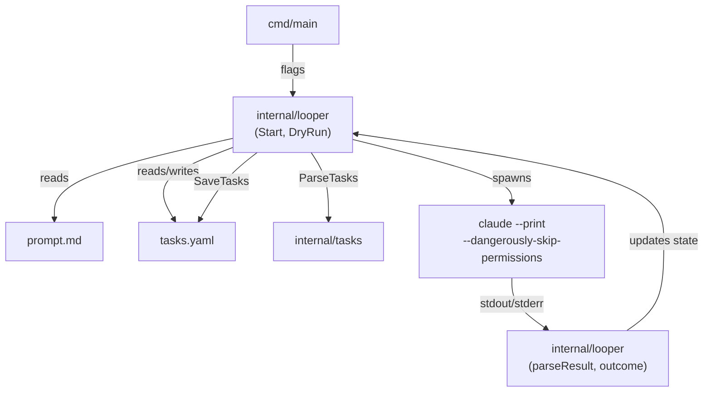
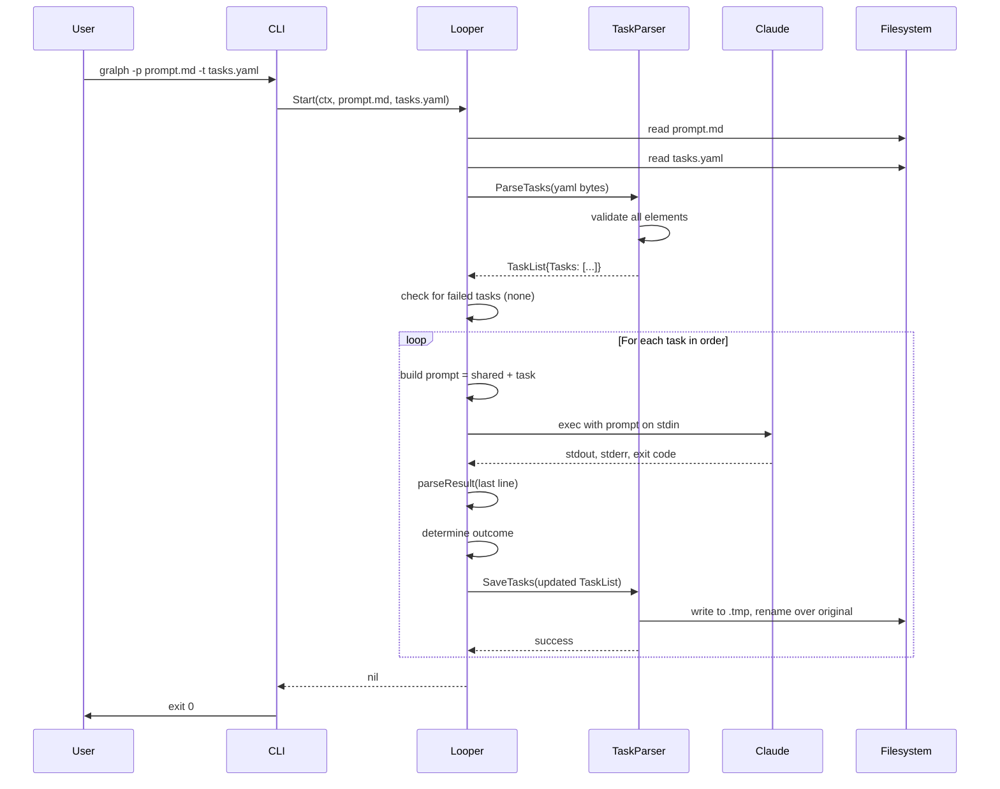
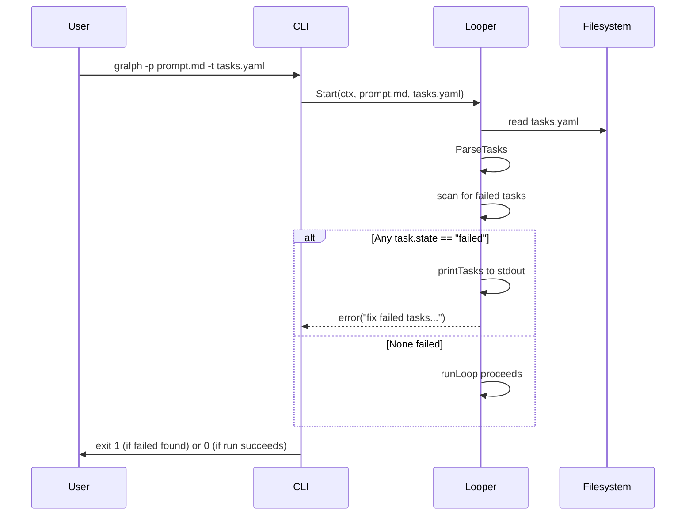
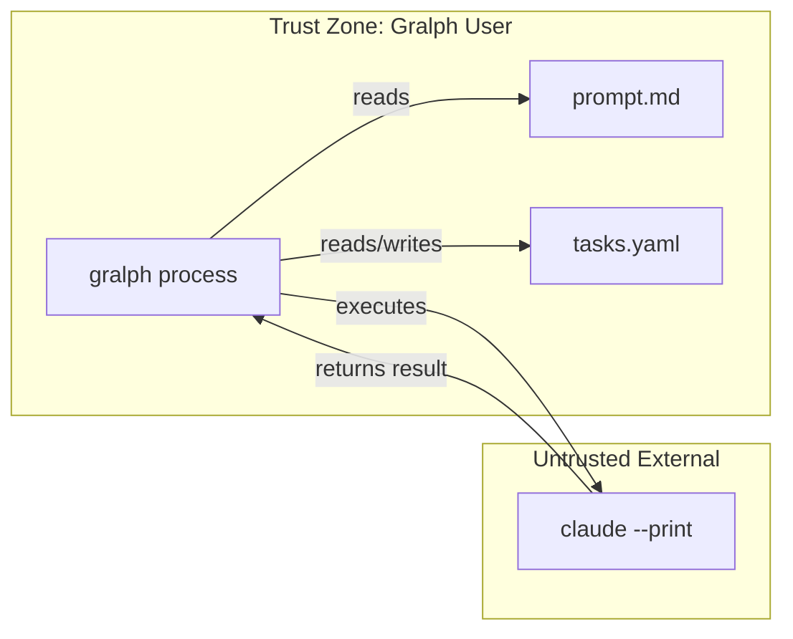
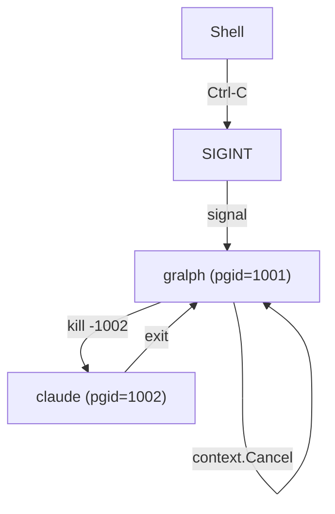

# Gralph — System Architecture

> **Version**: v01
> **Date**: 2026-09-25
> **Notes**: Realigned to the v0.6.2 design.

[Back to Overview](00_overview_v01.md) | [Back to Project README](../../README.md)

## Table of Contents

- [Architecture Overview](#architecture-overview)
- [Component Breakdown](#component-breakdown)
- [Data Flow](#data-flow)
- [Component Interactions](#component-interactions)
- [Boundary Definitions](#boundary-definitions)

## Architecture Overview

Gralph is organized into three layers: CLI entry point, looper orchestration, and task/state management. The looper loads both input files (prompt.md and tasks.yaml), validates preconditions, then walks each pending task, spawning a fresh Claude session with the combined prompt and reading the result to determine outcome.

## Component Breakdown

### CLI Entrypoint (cmd/main)

**Responsibilities:**
- Parse command-line flags (--prompt, --tasks, --dry-run, --version)
- Validate required flags
- Route to `looper.Start` (normal run) or `looper.DryRun` (validation only)
- Set up context with signal handling (SIGINT, SIGTERM)
- Exit with appropriate code (0 on success, 1 on error)

**Key Characteristics:**

| Characteristic      | Value                                   |
| ------------------- | --------------------------------------- |
| Language            | Go 1.27.1+                              |
| Responsibilities    | Argument parsing, signal setup, routing |
| Error Handling      | Print to stderr, exit 1 on any error    |
| State Management    | Stateless; passes context to looper     |

### Looper (internal/looper)

**Responsibilities:**
- Load and validate prompt file (must exist, readable, non-empty after trimming)
- Load and parse task file via `tasks.ParseTasks`
- Check preconditions (refuse to run if any task is `failed`)
- Iterate pending tasks in file order
- Combine shared prompt with each task
- Spawn `claude --print --dangerously-skip-permissions` in a process group
- Capture output, parse result line, determine outcome
- Update task state and save atomically
- Block on first failure
- Handle SIGINT/SIGTERM via context cancellation (kills claude process group)

**Key Characteristics:**

| Characteristic      | Value                                   |
| ------------------- | --------------------------------------- |
| Language            | Go 1.27.1+                              |
| Core Function       | `Start(ctx, promptFile, tasksFile)` orchestrates runs |
| Scaling Model       | Single-threaded, processes tasks sequentially |
| Communication       | Reads files, spawns subprocess, reads stdout |
| State Persistence   | Calls `tasks.SaveTasks` after each run  |

### Task Parser (internal/tasks)

**Responsibilities:**
- Unmarshal YAML without custom tags (rejects non-core tags)
- Validate each task element in sequence:
  - `id`: required, positive int16, unique
  - `name`: required, non-empty string, unique (case-insensitive)
  - `prompt`: required, non-empty string
  - `state`: optional string, must be "pending", "completed", or "failed"
  - `error`: optional string, written by gralph only
- Normalize `state`: empty → `pending`
- Save tasks back to YAML with 2-space indent, atomically (temp file + rename)

**Key Characteristics:**

| Characteristic      | Value                                           |
| ------------------- | ----------------------------------------------- |
| Language            | Go + gopkg.in/yaml.v3                           |
| Validation Model    | Strict: any invalid element rejects entire file |
| Persistence         | Atomic writes via temp-file + rename to path    |
| Comments            | Not preserved on rewrite (full re-marshal)      |

### Process Tree Manager (internal/looper/process_tree_unix.go)

**Responsibilities:**
- Configure spawned claude process to run in its own process group (Setpgid)
- On signal (SIGINT, SIGTERM), kill the entire process group
- Ensure no orphaned claude processes remain after cancellation

**Key Characteristics:**

| Characteristic      | Value                                       |
| ------------------- | ------------------------------------------- |
| OS Support          | Unix only (Linux, macOS, BSDs)              |
| Signal Handling     | SIGINT, SIGTERM from context cancellation   |
| Process Control     | kill(-pgid, signal) to terminate group      |

### Result Parser (internal/looper/result.go)

**Responsibilities:**
- Extract last non-blank, non-fence line from claude's stdout
- Parse as JSON with `state` and `error` fields
- Determine task outcome: completed if exit 0 + JSON `state: "completed"`, otherwise failed
- Format error message from JSON `error` or exit code

**Key Characteristics:**

| Characteristic      | Value                                   |
| ------------------- | --------------------------------------- |
| Input               | Claude's stdout and exit code           |
| Output              | (state, error message) tuple            |
| Fence Handling      | Skips lines matching ^\`\`\`             |
| JSON Parsing        | encoding/json; no custom unmarshallers  |

## Data Flow

### Normal Run (Happy Path)

### Failed Task Blocking

## Component Interactions

| From        | To              | Protocol                         | Purpose                                    | Data Format        |
| ----------- | --------------- | -------------------------------- | ------------------------------------------ | ------------------ |
| CLI         | Looper          | Direct function call             | Orchestrate start or dry-run               | Go function args   |
| Looper      | Filesystem      | os.ReadFile, os.WriteFile        | Load inputs, persist state                 | Text files (YAML)  |
| Looper      | TaskParser      | ParseTasks, SaveTasks functions  | Parse and serialize task lists             | YAML bytes         |
| Looper      | Claude          | os/exec.Cmd, stdin/stdout/stderr | Invoke Claude session                      | Text (prompt)      |
| Claude      | Looper          | stdout, exit code                | Return output and completion status        | JSON result line   |
| Looper      | ProcessManager  | Setpgid, kill(-pgid)             | Configure and control subprocess lifecycle | Unix signals       |

## Boundary Definitions

### Trust Boundary: Gralph Process vs. Filesystem

Gralph reads the prompt and task files. Both must be treated as user-provided code (they are executed by Claude). Gralph does not sanitize or sandbox them; the user is responsible for not running gralph against untrusted prompts or task files.

**Boundary Rules:**

| Boundary                              | What Crosses        | Rules                                                      |
| ------------------------------------- | ------------------- | ---------------------------------------------------------- |
| Gralph → Filesystem (read)            | Prompt, task files  | Files must be readable; content is not sanitized           |
| Gralph ← Filesystem (write)           | Task state          | Atomic writes; temp-file + rename ensures consistency      |
| Gralph → Claude (subprocess)          | Combined prompt     | Passed on stdin; fixed argv (--print, --dangerously-skip-permissions) |
| Claude → Gralph (subprocess output)   | Stdout, exit code   | Parsed for JSON result line; all other output logged only  |

### Process Boundary: Gralph Process Group

When gralph spawns claude, the subprocess runs in its own process group. On SIGINT/SIGTERM, the entire group is killed, isolating the signal from the host shell.

**Boundary Rules:**

- Gralph configures Setpgid on the claude subprocess so it has its own process group ID
- On signal, gralph's context cancels and kills the entire claude process group with kill(-pgid, signal)
- Shell does not send signal directly to claude; only gralph receives it
- This ensures no orphaned claude processes if gralph is killed unexpectedly

**Next:** [Deployment Architecture](05_deployment_architecture_v01.md)
