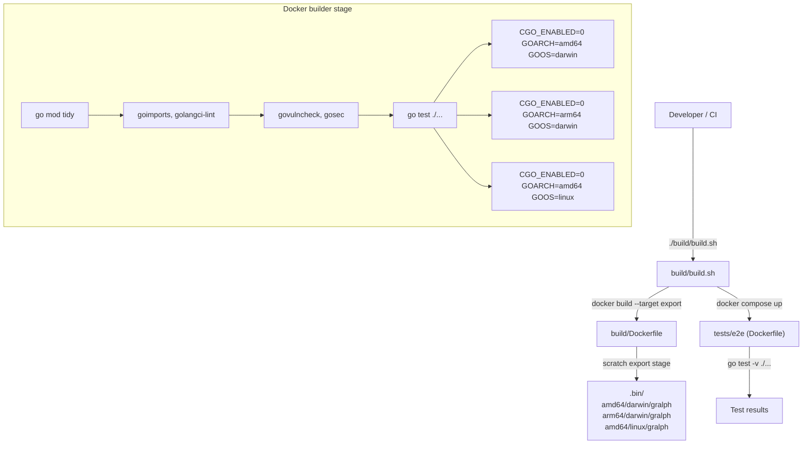

# Gralph — Deployment Architecture

[Back to Overview](00-overview.md) | [Back to Project README](../../README.md)

## Table of Contents

- [Deployment Overview](#deployment-overview)
- [Build Pipeline](#build-pipeline)
- [Binary Distribution](#binary-distribution)
- [E2E Test Stage](#e2e-test-stage)
- [Local Development Build](#local-development-build)
- [Operational Considerations](#operational-considerations)

## Deployment Overview

Gralph is a statically-compiled CLI binary. There is no server, no container runtime at deployment time, and no infrastructure to provision. Deployment means placing the correct binary on PATH. The build pipeline produces three targets from a single Docker invocation.



## Build Pipeline

### Builder Stage

The builder stage uses `ghcr.io/twistingmercury/golang-tooling:alpine`, a custom image with Go toolchain, golangci-lint, govulncheck, gosec, and goimports pre-installed. Build arguments inject version metadata:

| Build Arg      | Source in build.sh            | Injected As              |
| -------------- | ----------------------------- | ------------------------ |
| `BUILD_VER`    | `git describe --tags`         | `-ldflags ... version`   |
| `BUILD_DATE`   | `date -u +%Y-%m-%dT%H:%M:%SZ` | `-ldflags ... buildDate` |
| `BUILD_COMMIT` | `git rev-parse --short HEAD`  | `-ldflags ... gitCommit` |

Quality gates run sequentially and block compilation on failure:

1. `goimports -w .` — format and import ordering
2. `golangci-lint run` — static analysis
3. `govulncheck ./...` — known CVE scan
4. `gosec ./...` — security anti-pattern scan
5. `go test ./...` — unit tests (looper package + any future packages)

Compilation runs after all gates pass. Three `go build` invocations produce separate binaries for each OS/arch target.

### Export Stage

A `FROM scratch AS export` stage contains only the binary tree. `--target export --output .bin` extracts the directory without running a container. The output layout is:

```
.bin/
  amd64/darwin/gralph
  arm64/darwin/gralph
  amd64/linux/gralph
```

### Known Pipeline Issues

1. **`go mod tidy` in Dockerfile vs. `go mod verify`**: Running `go mod tidy` during the Docker build can silently alter `go.sum` without surfacing the diff. The correct gate is `go mod verify`, which asserts that the committed module graph matches the downloaded cache. This should be raised as a follow-up item.

2. **E2e container rebuilds from source**: `tests/e2e/Dockerfile` copies all source and builds the gralph binary again via `TestMain`. It does not reuse the already-exported binary from the builder stage. For a 13-cycle PRD scope this is acceptable; for a CI pipeline with longer compile times it is wasteful.

3. **`make test` excludes e2e**: `Makefile`'s `test` target runs `go test -v ./internal/...` only. Developers running `make test` locally never exercise the e2e suite. The Makefile should either alias `build/build.sh` for full test coverage or add a separate `make e2e` target.

## Binary Distribution

There is no package registry or automated release pipeline in the current scope. Distribution is manual:

| Method                 | Command                                      | Notes                                                     |
| ---------------------- | -------------------------------------------- | --------------------------------------------------------- |
| Local install to GOBIN | `make install`                               | Copies from `.bin/$GOOS/$GOARCH/gralph` to `$HOME/go/bin` |
| Manual copy            | `cp .bin/amd64/linux/gralph /usr/local/bin/` | CI or container use                                       |
| Direct go build        | `go build -o gralph ./cmd/main`              | Development only; no version metadata                     |

## E2E Test Stage

The e2e test suite is a separate Go module (`github.com/twistingmercury/gralph/tests/e2e`). It builds the gralph binary in `TestMain`, then invokes it as a subprocess for each test case. It does not require Claude to be present — it tests only CLI flag behavior and non-zero exit paths.

`build/build.sh` runs the e2e stage via `docker compose`:

```bash
docker compose -f tests/docker-compose.yaml up --exit-code-from tests
```

The `docker-compose.yaml` maps to `tests/e2e/Dockerfile`, which:

1. Uses `golang:1.26-alpine` (not the custom tooling image — no linters needed here).
2. Downloads main module and e2e module dependencies separately for layer caching.
3. Sets `WORKDIR /workspace/tests/e2e` and runs `go test -v ./...`.

## Local Development Build

For rapid iteration, use the Makefile `local` target, which bypasses Docker entirely:

```bash
make local
# Produces: .bin/$GOOS/$GOARCH/gralph
```

The local build injects the same version metadata via `-ldflags` but skips all quality gates. It is not a release artifact.

## Operational Considerations

### Runtime Requirements

| Requirement                             | Detail                                                          |
| --------------------------------------- | --------------------------------------------------------------- |
| `claude` CLI on PATH                    | Required at runtime; gralph fails on first invocation if absent |
| Read access to prompt and PRD files     | Validated at startup via `os.Stat`                              |
| Write access to PRD directory           | Required for atomic temp+rename during abandon                  |
| Write access to progress file directory | Required for `os.OpenFile` with `O_CREATE`                      |

### Interruption and Context Cancellation

Gralph propagates the root `context.Background()` from `main` to `exec.CommandContext`. Sending SIGINT terminates the in-flight Claude invocation via the context. The PRD is only mutated on an explicit abandon at the attempt limit — a mid-loop interrupt leaves the PRD unchanged at the last completed item boundary.

### Log Output

All log lines go to stdout prefixed with `[gralph]`. Errors go to stderr. There is no log level, no structured JSON output, and no log file. Redirect stdout to a file if persistent logging is needed:

```bash
gralph --prd-md scripts/PRD.md --prompt-md scripts/PROMPT.md 2>&1 | tee run.log
```

### No Rollback Mechanism

Gralph writes to PRD.md atomically but does not version-control the file. If an abandon mutation is incorrect, recovery requires manually editing PRD.md or using git to restore the previous state. This is acceptable given that PRD.md is expected to live in a git repository.
