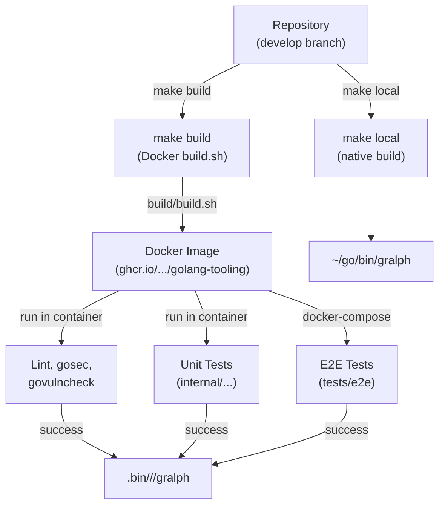

# Gralph — Deployment Architecture

> **Version**: v01
> **Date**: 2026-09-25
> **Notes**: Realigned to the v0.6.2 design.

[Back to Overview](00_overview_v01.md) | [Back to Project README](../../README.md)

## Table of Contents

- [Deployment Overview](#deployment-overview)
- [Installation](#installation)
- [Build Process](#build-process)
- [Binaries and Platforms](#binaries-and-platforms)
- [CI Workflow](#ci-workflow)
- [Testing Strategy](#testing-strategy)

## Deployment Overview

Gralph is a CLI tool installed to the user's Go binary directory (GOBIN, default `~/go/bin`). Local development uses `make local` for fast native builds; release builds use `make build` (Docker-based), which produces cross-compiled binaries and runs the full e2e test suite. CI (GitHub Actions) runs `build/build.sh`, the single source of truth for the release build.



## Installation

### Development Installation

```bash
git clone https://github.com/twistingmercury/gralph.git
cd gralph
make local install   # builds native, copies to ~/go/bin
gralph --version
```

`make local` builds the binary to `.bin/local/gralph`. `make install` copies it to GOBIN (default `~/go/bin`). Always run both together; `make install` alone will copy a stale binary if the source changed.

### Release Binaries

There is no published release artifact. `make build` cross-compiles
`.bin/<arch>/<os>/gralph` for linux and darwin on amd64 and arm64; copy the
one for your platform onto your PATH, or build from source with
`make local install`.

## Build Process

### Local Build (`make local`)

- Invokes `go build` with version ldflags (git tag, commit hash, build date)
- Outputs to `.bin/local/gralph`
- Fast (~2s on modern hardware)
- No testing, no linting
- Used by developers for quick iteration

### Release Build (`make build` / `build/build.sh`)

1. **Docker image build**: Uses `build/Dockerfile` with base image `ghcr.io/twistingmercury/golang-tooling:go1.27.1`
2. **In-container lint**: goimports, golangci-lint, govulncheck, gosec
3. **In-container unit tests**: `go test -v ./internal/...`
4. **Cross-compilation**: Builds binaries for linux and darwin on amd64 and arm64
5. **Binary export**: Outputs to `.bin/<arch>/<os>/gralph`
6. **E2E tests**: Runs `tests/e2e` suite in a container using docker-compose

If any step fails (lint, tests, e2e), the build stops and exits non-zero. CI relies on this all-or-nothing behavior.

**Key files:**

- `build/Dockerfile`: Multi-stage image; builder stage runs lint/test, export stage copies binaries
- `build/build.sh`: Orchestrates docker build, binary export, and e2e via docker-compose
- `Makefile`: Targets `local` (native), `build` (Docker), `test` (unit only), `analyze` (lint)

### Version Embedding

Version is embedded at build time via `-X` ldflags on
`internal/version.version`, `buildDate`, and `gitCommit`. The Makefile
(`GIT_TAG`, `BUILD_DATE`, `GIT_COMMIT`) and `build/Dockerfile` (`BUILD_VER`,
`BUILD_DATE`, `BUILD_COMMIT`) set the same three values from git and must stay
in sync.

## Binaries and Platforms

Gralph supports Unix platforms only. No Windows build target.

| Platform | CPU Architecture | Built by `make build` |
| -------- | ---------------- | --------------------- |
| Linux    | amd64, arm64     | Yes                   |
| macOS    | amd64, arm64     | Yes                   |
| Windows  | —                | No; support removed   |

Binaries are statically linked (pure Go, no CGO). They run on the target OS without additional runtime dependencies (except the Claude CLI must be on PATH).

## CI Workflow

GitHub Actions runs on `develop` and `main` branches for both push and pull request events.

**Workflow: `.github/workflows/ci.yaml`**

1. Checkout code with full history (for version detection)
2. Run `./build/build.sh`:
   - Docker build (lint, test, cross-compile)
   - E2E tests in container
3. Exit with build/test result code

**Total time**: ~5–10 minutes depending on GitHub Actions runner performance and Docker image cache hits.

**Failure handling**: If any step fails, the workflow fails and blocks the PR. No partial passes; the entire build must succeed.

## Testing Strategy

### Unit Tests

- Run via `make test` → `go test -v ./internal/...`
- Covers task parsing, state transitions, result parsing, process management
- Uses testify (require for preconditions, assert for checks)
- Test suites: `internal/tasks`, `internal/looper`
- Run natively or in Docker; Docker is authoritative

### E2E Tests

- Separate Go module at `tests/e2e/`; `go test ./...` from root never includes them
- Black-box: no internal imports, tests the gralph binary as a subprocess
- Uses a fake `claude` executable (built in test setup) on PATH
- Driven by env vars: `FAKE_CLAUDE_OUTPUT` to customize Claude's behavior
- Tests cover:
  - Valid task files, completed tasks, failed tasks, missing result line
  - State persistence (state file rewritten correctly)
  - Signal handling (SIGINT/SIGTERM kills claude group)
  - Dry-run validation (--dry-run works, doesn't run claude)
  - Prompt formatting (task + shared prompt combined correctly)
- Run via `make build` → docker-compose in container (authoritative)
- Native e2e run possible with `make local && cd tests/e2e && GRALPH_BINARY=... go test` but not recommended (Go test cache can mask binary changes)

### Test Coverage

All non-trivial code paths are exercised:
- Task parsing: valid, invalid ids/names/prompts/states and task elements, duplicate detection, tag rejection
- Looper: normal runs, failed tasks, dry-run, result parsing, atomic writes
- Result parsing: JSON with state/error, missing lines, malformed JSON, fence line handling
- Signal handling: SIGINT/SIGTERM during run, process group killed

Tests pin the combined-prompt wire contract (shared + task format) via golden assertions.

**Next:** [Back to Overview](00_overview_v01.md)
