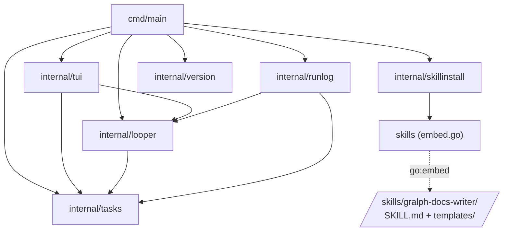

# Dependency graph

Package-level dependencies of the `src/` module. Standard library, test files,
and `tests/` are left out; third-party modules are listed after the graph.

Solid arrows are Go imports. Dotted arrows are the embed.

## What each edge carries

| Edge                     | What's used                                                                                                                                  |
| ------------------------ | -------------------------------------------------------------------------------------------------------------------------------------------- |
| `main → looper`          | `Start`, `DryRun`, `LoadTasksReport`, `ErrFailedTasks`, `OpenRepo`/`Repo` (and its `CheckLogDir`), `SandboxArgs`, `BypassArgs` |
| `main → tui`             | `NeedsWizard`, `Wizard`, `ErrCancelled`, `Settings`, `Given`, `Run`                                                                          |
| `main → runlog`          | `Info`, `RunDir`, `Open`, `Log` (`Record`, `Close`)                                                                                          |
| `main → tasks`           | `ParseTimeout`, `TaskList`, `SaveTasks`                                                                                                      |
| `main → skillinstall`    | `Install`                                                                                                                                    |
| `main → version`         | `Print`, `Version`                                                                                                                           |
| `tui → looper`           | `Run`, `Event` and the kinds the view shows (`TaskStarted`, `Activity`, `TaskFinished`, `RunDone`), `Repo`; for the wizard's checks `LoadTasks`, `ErrFailedTasks`, `SandboxArgs`, `OpenRepo` (and `CheckLogDir`) |
| `tui → tasks`            | `Task`, `TaskList` (and `GateList`), `Gate`, `ParseTimeout`, the three state constants                                                       |
| `looper → tasks`         | `Task`, `TaskList`, `Gate`, `ParseTasks`, `SaveTasks`, `ParseTimeout`, state constants                                                       |
| `runlog → looper`        | `Event` and all seven of its kinds                                                                                                           |
| `runlog → tasks`         | `FailedState`                                                                                                                                |
| `skillinstall → skills`  | `FS`                                                                                                                                         |

## Third-party modules

| Module                            | Imported by      | For                                                       |
| --------------------------------- | ---------------- | --------------------------------------------------------- |
| `charm.land/bubbletea/v2`         | `internal/tui`   | The run view, and running the wizard's forms              |
| `charm.land/bubbles/v2`           | `internal/tui`   | The run view's panes (`viewport`)                         |
| `charm.land/lipgloss/v2`          | `internal/tui`   | The run view's layout and colors                          |
| `charm.land/huh/v2`               | `internal/tui`   | The setup wizard's steps, gate editor, and review screen  |
| `github.com/charmbracelet/x/term` | `cmd/main`       | The terminal check that picks plain mode or the view      |
| `github.com/spf13/pflag`          | `cmd/main`       | Flags                                                     |
| `gopkg.in/yaml.v3`                | `internal/tasks` | The task file                                             |
