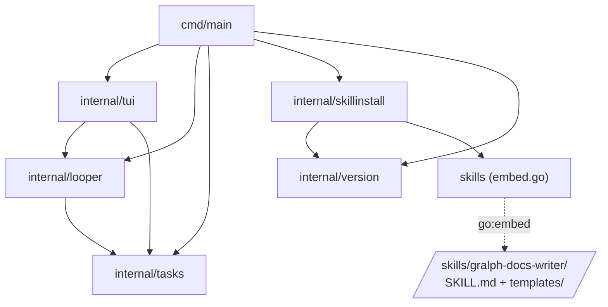

# Dependency graph

Package-level dependencies of the `src/` module. Standard library, third-party
modules, test files, and `tests/` are left out.

Solid arrows are Go imports. Dotted arrows are the embed and the build output.

## What each edge carries

| Edge                     | What's used                                                                                                          |
| ------------------------ | -------------------------------------------------------------------------------------------------------------------- |
| `main → looper`          | `Start`, `DryRun`, `LoadPrompt`, `LoadTasksReport`, `ErrFailedTasks`, `OpenRepo`/`Repo`, `SandboxArgs`, `BypassArgs` |
| `main → tui`             | `Setup`, `Run`                                                                                                       |
| `main → tasks`           | `ParseTimeout`, `TaskList`                                                                                           |
| `main → skillinstall`    | `Install`, `Check`                                                                                                   |
| `main → version`         | `Print`                                                                                                              |
| `tui → looper`           | `Run`, `Event` and its four kinds, `Repo`, `LoadTasks`, `LoadPrompt`                                                 |
| `tui → tasks`            | `Task`, `TaskList`, the three state constants                                                                        |
| `looper → tasks`         | `Task`, `TaskList`, `Gate`, `ParseTasks`, `SaveTasks`, `ParseTimeout`, state constants                               |
| `skillinstall → version` | `Version`                                                                                                            |
| `skillinstall → skills`  | `FS`                                                                                                                 |
